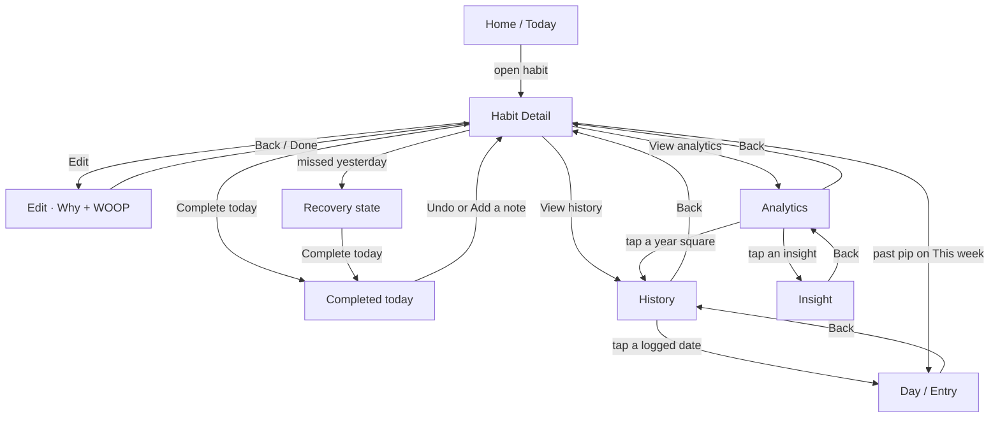

# Habit Detail flow

How the per-habit stack is supposed to work, and why each section exists.

**Job:** Habit Detail is a **recommitment surface**, not a stats dashboard. It answers “what do I do now,” keeps one small trustworthy snapshot, and hands the record to History and the interpretation to Analytics.

Clickable prototype (mock + why / pain / solve / revenue for each section): [`docs/mockups/habit-detail-full-flow.html`](./mockups/habit-detail-full-flow.html).

---

## Who owns what

A person who only wants to tick a box never has to open Detail. Each screen below Detail has one job so Detail can stay short.

| Surface          | Owns                                        | Does not own                                         |
| ---------------- | ------------------------------------------- | ---------------------------------------------------- |
| **Home / Today** | Fast check-off                              | Why, recovery copy, heatmaps, notes                  |
| **Habit Detail** | Today’s action, one snapshot, calm recovery | Past-date edits, WOOP authoring, year heatmap, Pause |
| **Edit**         | Authoring — why line, identity, WOOP        | Completing today                                     |
| **History**      | The record — dates, notes, corrections      | Pattern copy, strength scores                        |
| **Day / Entry**  | One day’s truth (status, note, correct)     | Week/month charts                                    |
| **Analytics**    | Patterns and the evidence behind them       | Editing a day                                        |
| **Insight**      | The counts and dates behind one claim       | Completing today                                     |

Edit is a separate overlay (`onEdit`). The other nested screens are routes inside `useDetailFlow`.

---

## Navigation

Back always returns to the previous route. Closing from Detail leaves the modal entirely.

---

## Three Detail states

The page shape stays the same. Only the card above the button and the action slot contents change.

| State         | When                                                  | Card above the button                                                                                                                                         | Primary slot                                                                                          |
| ------------- | ----------------------------------------------------- | ------------------------------------------------------------------------------------------------------------------------------------------------------------- | ----------------------------------------------------------------------------------------------------- |
| **Ready**     | Today not logged, yesterday was (or there is no miss) | Why line                                                                                                                                                      | Live toggle: empty circle, **Complete today**, hint word **Tap**. It stays live after logging.        |
| **Completed** | Today is logged                                       | Why line                                                                                                                                                      | Same live toggle: filled check, **Logged today**, hint word **Undo**. Re-tapping unlogs today.        |
| **Recovery**  | The last scheduled day was not logged                 | Amber recovery card (replaces why): headline “{Day} got away. {N} days didn’t.” — or “{Day} got away. Today doesn’t have to.” when no run was actually broken | Same live toggle as Ready. The fixed-height slot below shows the recovery hint until today is logged. |

Recovery **replaces** the why card. It does not stack under it. Amber exists only here, so the color itself means “start again,” not “you failed.” The amber wash covers the hero **and** the fixed header — the header is a separate node from the hero gradient, so it takes the same first stop or the top of the page shows a mint-over-amber seam. While recovery is on screen the strength snapshot stays, with the caption “Dipped, not reset. Recent days still count most.” Strength is the one number built to survive a miss; hiding it hid the reassurance. The **Analytics door stays**. An earlier revision hid it too, following the prototype, but recovery is the ordinary state for anyone who did not log the last scheduled day, and the record doors are the only route to Analytics anywhere in the app — so the page effectively disappeared. A door is not a grade.

The action area is a **fixed-height slot** in all three states so History and Analytics never jump when today completes. Under the toggle, that fixed-height secondary slot holds only the note row, the recovery hint, the unavailable text, or the caption “Tap to log today. You can undo anytime.”

---

## Habit Detail — section by section

Scroll order, top to bottom: Header, Habit name + schedule, Why card / Recovery card, Complete today, This week, Strength snapshot, Streak goal (`components/DetailGoalCard/`), The record, Insight.

### Header

**What:** Circled back chevron on the left (closes the modal). **Edit** as green text on the right. The habit name is the hero title only at rest. After the hero name scrolls away, that same name pins in the header.

**Why:** Detail is a modal over the habits list, which can be today or another selected day — so a “Today” or “Home” label is the wrong destination. A chevron in a disc is “leave this screen,” with VoiceOver still announcing Back to Home. One close control. The pinned title is wayfinding after the hero is gone, not a second title on first paint.

### Habit name + schedule

**What:** Centered display name, then a quiet schedule line from real fields (time-of-day grouping · cadence), e.g. “Morning routine · Daily”. If the habit has no time-of-day, just the cadence (“Daily”). Do not invent a morning grouping.

**Why:** You should recognize the habit before you see any number. Schedule is context, not a chart.

### Why card

**What:** One sentence. Priority: **why → identity → wish**. Hidden if all three are empty. Never a placeholder essay.

**Why:** Recommitment needs a reason, not a lecture. A hard morning uses the plan from Edit; it does not need WOOP in the way of Complete today.

**Must not:** Host Wish / Outcome / Obstacle / Plan. Those stay on Edit.

### Recovery card

**What:** Headline “{Day} got away. {N} days didn’t.” where N is the run the miss actually ended, spelled out (“Eight days didn’t.”); with no broken run it reads “{Day} got away. Today doesn’t have to.” Body: one sentence, “Your {best}-day record still stands.” (or “That {N}-day run is still your record.” when the broken run was the record, or “Today starts the next one.” with no record). No rule, no strength delta: the dial is on the page and the two-minute version is in the slot below.

N comes from the completion log — the same runs the History rail draws — never from `habit.currentStreak`, which is a stored field nothing recomputes on a miss.

**Why:** A miss is a start-again moment, and the honest framing is that the days already banked are still banked. No rest-day UX, no streak shaming, no rank.

**Must not:** Use amber anywhere else. Must not accuse (“you broke a streak of N”). Must not invent a strength delta — the decay is proportional, so “dipped 3 points” is a number the app cannot know.

### Complete today / Logged today

**What:** One live toggle. Ready shows an empty circle, **Complete today**, and the hint word **Tap**. Logged shows a filled check, **Logged today**, and the hint word **Undo**. Re-tapping unlogs today, so the control never swaps out. The fixed secondary slot below it shows “Tap to log today. You can undo anytime.” before logging, the recovery hint in recovery, and **Add a note / Edit note** after logging.

When today changes from not logged to logged, show a green success toast for 4000ms: `Logged — {N}-day streak.` with an **Undo** action. It fires only on a genuine not-logged → logged transition; never on unlog, never on mount when today is already logged, and never when the screen switches to a different habit. Pressing **Undo** unlogs the day the toast fired for — captured at fire time, not read at press time — and dismisses the toast. The toast also auto-hides if today stops being logged by any other route.

`{N}` is the post-toggle streak read off the completion log, frozen at the moment the toast fires. It is never `habit.currentStreak`: that field is stored, is not recomputed on a miss, and made the toast announce “9-day streak” on the first day back before correcting itself.

**Why:** The daily tap must stay one tap and never bury. After success, the screen should feel finished — not offer a second complete. Notes are optional and private; they do not require a completed day, but the completed state is the natural moment to add one.

**Must not:** Toggle past dates from this button. Past corrections go through History → Day.

### This week

**What:** Seven pips, date range, `N days logged`. Today has a distinct pip (white ring, green center). Future and pre-creation days are inert. Scheduled misses, unscheduled days, and known pause windows use the same record states as History and Day.

**Why:** A small, trustworthy snapshot of _this_ week — enough to feel the week without opening History. A count from the record, not an “N of M” quota. Streak totals and year grids do not belong here. The rail (Current / Longest / Days done) that shipped here for a while is gone; those numbers live on the Goal ladder and on Analytics.

**Taps:**

- **Today** → same as Complete today / undo
- **Past** → Day / Entry (inspect or correct)
- **Future** → ignore

### Strength snapshot

**What:** Compact row card with a 44px ring, the number inside the ring, a band label, and the caption “Momentum from every check-in, weighted toward recent days. A miss dips it — it never resets.” Visible in recovery with the caption “Dipped, not reset. Recent days still count most.”

**Why:** One honest snapshot of how established the habit feels. No `%`, no leaderboard, no comparison to other people. Strength is not a grade and not a streak.

**Must not:** Become a second dashboard (progress bar + ladder + the same number restated). Full strength explanation, if any, belongs elsewhere — not as a wall of stats on Detail.

### The record

**What:** Two rows that never move.

- **Calendar & notes** — “View or correct past days” (→ History)
- **Patterns & trends** — “See what helps you stay consistent” (→ Analytics)

Internally the screens stay History and Analytics; the visible labels use the user’s words.

In recovery both rows stay, and so does the strength snapshot: a door is not a grade, and strength is the one number built to survive a miss. Hard rule 8 still stands: when today completes, the History / Analytics rows do not move.

**Why:** Detail is not the archive and not the lab. These are doors, not previews of those screens. Putting a year heatmap or a chart here would turn Detail back into a dashboard.

### Insight line

**What:** One grounded sentence with a spark icon, or nothing. Tapping opens Insight. Examples: most check-ins happen in a daypart; a weekday is where it slips.

**Why:** A hint is useful. A list of claims is Analytics. The line must be auditable — tap through to the counts — so Detail never feels like it is inventing a story.

**Must not:** Predict, shame, or show more than one claim.

### Pause — not on this flow

**Decision:** We are not shipping Pause on Habit Detail going forward.

Detail is a recommitment surface. Pause is an exit from showing up. A “hold your streak” card on the same screen as recovery undercuts recovery, the no-rest-day rule, and no-streak-shaming.

Pause/resume mutations stay in the backend for Settings and other surfaces that already use them. Revisit only if travel/hold becomes a real, documented support problem — and even then it belongs in Edit/Settings, not on this recommitment surface. Do not invent rest-day UX.

If a previously paused habit is opened, Detail shows a neutral, non-actionable paused state. It never offers Complete or Recovery until the habit is active again.

---

## History

**Job:** The record. Every date, note, and correction. This is the only place a past day should be edited (plus Day, which History opens).

| Section                                                                | Why                                                                                                      |
| ---------------------------------------------------------------------- | -------------------------------------------------------------------------------------------------------- |
| Month bar **above** the calendar card                                  | Changing month is navigation, not part of the grid.                                                      |
| Month grid                                                             | See the month at a glance. Cells are large enough to open a day.                                         |
| Legend: Completed / Missed / Not scheduled / Paused / Today / Upcoming | States stay legible without calling an open, off-schedule, pre-creation, or paused date a miss.          |
| Daily record                                                           | Every date since creation, with truthful states and notes; a note means “there is writing,” not a score. |
| Footnote                                                               | Tells you past dates are for seeing or correcting, not for silent toggles.                               |

**Must not:** Habit-level stats cards, year heatmap, or toggling a day without opening it. Year cells are too small to edit; even month cells here **open Day** instead of flipping completion in place.

---

## Day / Entry

**Job:** One day’s truth.

| Section                        | Why                                                                               |
| ------------------------------ | --------------------------------------------------------------------------------- |
| Date title + relative label    | You know which day you are correcting.                                            |
| Status card                    | Completed vs no entry, with time if we have it.                                   |
| Note (italic, no extra quotes) | Notes are independent of completion. A miss can still have a note (“travel day”). |
| Correct this day               | Explicit undo/complete and add/edit note — no hidden side effects.                |
| Previous / Next                | Walk adjacent days without returning to the grid.                                 |
| Footnote                       | Edits change History and the numbers on Analytics. That is the contract.          |

**Must not:** Live on Detail as inline past-day editing. A mis-tap on a tiny cell must never silently rewrite the wall.

---

## Analytics

**Job:** Patterns from real check-ins. Nothing is predicted.

| Section               | Why                                                                                                                                                                                                                                                                                                                                                                                                                                                                                                                                                                                                               |
| --------------------- | ----------------------------------------------------------------------------------------------------------------------------------------------------------------------------------------------------------------------------------------------------------------------------------------------------------------------------------------------------------------------------------------------------------------------------------------------------------------------------------------------------------------------------------------------------------------------------------------------------------------- |
| **Where you stand**   | Verdict first, in words: headline, the month-over-month body, then the sparkline as proof. Between body and sparkline sits the **next step** — one derived line, e.g. “Covering Fridays would have put August at 93%. It’s the only weekday under 60%.” It states arithmetic that already happened; it never claims a month that has not been lived.                                                                                                                                                                                                                                                              |
| Next-step suppression | The next step is **omitted entirely** — no placeholder, no hedge — unless all of: a weak weekday exists (`oneFix`), this month has at least one uncovered miss on it, covering those misses raises this month's rate, and some earlier month already beat this month (there is room to climb). Its job is the **projection**; when it can't add one it renders nothing, because “Fridays are where it slips” is already a row below. The evidence clause degrades in the same way: “the only weekday under 60%” only when literally true, else “Fridays sit at 25% — every other day is above 50%”, else nothing. |
| **Year at a glance**  | Establishing shot: 365 binary days (logged or not), not a score. Lives **here**, never on Detail. Tap a square → that month in History. Cells are too small to edit.                                                                                                                                                                                                                                                                                                                                                                                                                                              |
| Weekly / Monthly tabs | Same log, two grains. **Weekly stays counts.** **Monthly is % of scheduled days** (current month only counts days that have happened). Empty weeks show as zero — nothing is filled in.                                                                                                                                                                                                                                                                                                                                                                                                                           |
| Range chart           | How the log actually moved.                                                                                                                                                                                                                                                                                                                                                                                                                                                                                                                                                                                       |
| What the log shows    | Tappable insight rows. Each claim can be audited.                                                                                                                                                                                                                                                                                                                                                                                                                                                                                                                                                                 |
| Footnote              | “Every number here comes from check-ins you recorded.”                                                                                                                                                                                                                                                                                                                                                                                                                                                                                                                                                            |

**Must not:** Edit a day, show a strength dashboard, or invent rest days. A pattern is not a cause — Insight says so.

---

## Insight

**Job:** Show the counts and dates behind one Analytics (or Detail line) claim. Evidence layout: claim, prose with real numbers, the chart or split, a stat strip. Optional next step never completes the habit.

**Empty:** If `insightId` is missing or that pattern isn’t ready, show “Nothing to show for this insight yet.” Do not claim the sample is too small.

**Why:** Trust. If Detail says “mornings work,” you can see the sample. **What’s working** can send you to Edit to adjust a reminder. **One fix** can suggest a cue. Neither should complete the habit for you.

---

## Edit (why + WOOP)

**Job:** Authoring. Split into two blocks on purpose:

1. **Shown on Habit Detail** — why (the sentence above Complete today) and optional identity (used only if why is empty).
2. **Written here, not on Detail** — WOOP (Wish, Outcome, Obstacle, Plan). Naming the obstacle is the useful part.
3. **Manage habit** — Archive and Delete live at the bottom of Edit. Archive explains that the habit can be restored from Settings; Delete explicitly confirms permanent history removal.

**Why:** A hard morning uses the plan; it does not need this whole page in the way of the button.

---

## Notes

Notes are **per day**, stored on the habit (`dayNotes`), and independent of whether the day is complete.

| Entry point                               | Why                                                       |
| ----------------------------------------- | --------------------------------------------------------- |
| Completed Detail → Add a note / Edit note | Natural after logging today.                              |
| Day → note card + Correct this day        | The record for that date.                                 |
| History list                              | A mark when a note exists, so you can find writing later. |

The sheet copy: optional, only you will see this (today); on past days, notes are part of that day’s record.

---

## Hard rules

Do not reopen these without an explicit product decision:

1. Habit Detail is a recommitment surface, not a stats dashboard.
2. The **year heatmap lives on Analytics**, not Detail. An optional year glance on Detail is **not shipping**.
3. **Past-day edits** only on Day / Entry (opened from History or a past This-week pip).
4. **Amber only on recovery.**
5. **No rest-day UX**, no streak shaming, no ranks, no glassmorphism.
6. Why is a **line** on Detail and a **section** on Edit.
7. Insights must be **auditable** against real check-ins. Nothing is predicted.
8. The History / Analytics rows **do not move** when today completes.
9. **No Pause on Detail.** We are not going with pause on this flow unless travel/hold becomes a documented support problem — and even then it must not sit on the recommitment surface.
10. **Archive and Delete live in Edit, not Detail.** Archive keeps history and explains restoration; Delete requires explicit confirmation.

---

## Code map

| Piece                                     | Where                                                                                                                               |
| ----------------------------------------- | ----------------------------------------------------------------------------------------------------------------------------------- |
| Modal + header + note sheet               | `src/screens/HabitDetailScreen/HabitDetailScreen.tsx`                                                                               |
| Route stack                               | `useDetailFlow.ts`, `useDetailFlowActions.ts`, `DetailFlowSwitch.tsx`                                                               |
| Detail scroll                             | `HabitDetailContent.tsx`, `HabitDetailContent.hooks.ts`, `HabitDetailContent.types.ts` → `DetailHeroBanner` + `HabitDetailSections` |
| Hero (name, dial, why/recovery, complete) | `components/DetailHeroBanner/`                                                                                                      |
| Completion undo toast                     | `completionToast.ts`, `useCompletionToast.ts`, `components/CompletionUndoToast.tsx`                                                 |
| Insight palette                           | `insightPalette.ts` → `insightPalette.core.ts`, `insightPalette.tokens.ts`, `insightPalette.types.ts`                               |
| Strength snapshot                         | `components/StrengthSnapshot.tsx`, `components/StrengthDial.tsx`                                                                    |
| Why fallback                              | `components/resolveWhy.ts`                                                                                                          |
| This week / doors / insight line          | `ThisWeekCard`, `RecordDoors`, `InsightLine`                                                                                        |
| History                                   | `components/HabitHistoryScreen/`                                                                                                    |
| Day                                       | `components/DayDetailScreen/`                                                                                                       |
| Analytics                                 | `components/HabitAnalyticsScreen/`                                                                                                  |
| Insight                                   | `components/InsightDetailScreen/`                                                                                                   |
| Day notes                                 | `useDayNotes.ts`, `convex/habits/updateDayNote.ts`                                                                                  |
