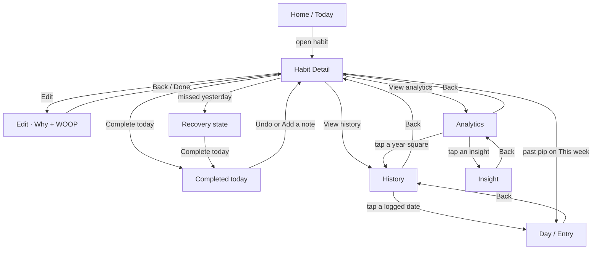

# Habit Detail flow

How the per-habit stack is supposed to work, and why each section exists.

**Job:** Habit Detail is a **recommitment surface**, not a stats dashboard. It answers “what do I do now,” keeps one small trustworthy snapshot, and hands the record to History and the interpretation to Analytics.

Clickable prototype (mock + why / pain / solve / revenue for each section): [`docs/mockups/habit-detail-full-flow.html`](./mockups/habit-detail-full-flow.html).

---

## Who owns what

A person who only wants to tick a box never has to open Detail. Each screen below Detail has one job so Detail can stay short.

| Surface          | Owns                                        | Does not own                                         |
| ---------------- | ------------------------------------------- | ---------------------------------------------------- |
| **Home / Today** | Fast check-off                              | Why, recovery copy, heatmaps, notes                  |
| **Habit Detail** | Today’s action, one snapshot, calm recovery | Past-date edits, WOOP authoring, year heatmap, Pause |
| **Edit**         | Authoring — why line, identity, WOOP        | Completing today                                     |
| **History**      | The record — dates, notes, corrections      | Pattern copy, strength scores                        |
| **Day / Entry**  | One day’s truth (status, note, correct)     | Week/month charts                                    |
| **Analytics**    | Patterns and the evidence behind them       | Editing a day                                        |
| **Insight**      | The counts and dates behind one claim       | Completing today                                     |

Edit is a separate overlay (`onEdit`). The other nested screens are routes inside `useDetailFlow`.

---

## Navigation

Back always returns to the previous route. Closing from Detail leaves the modal entirely.

---

## Three Detail states

The page shape stays the same. Only the card above the button and the action slot contents change.

| State         | When                                                  | Card above the button                    | Primary slot                                                                                |
| ------------- | ----------------------------------------------------- | ---------------------------------------- | ------------------------------------------------------------------------------------------- |
| **Ready**     | Today not logged, yesterday was (or there is no miss) | Why line                                 | **Complete today** + “Logs today’s date. You can undo anytime.”                             |
| **Completed** | Today is logged                                       | Why line                                 | **Done today** confirmation. Undo and Add/Edit note sit underneath — not a second complete. |
| **Recovery**  | Yesterday was scheduled and not logged                | Amber **Pick it back up** (replaces why) | Same Complete today as Ready                                                                |

Recovery **replaces** the why card. It does not stack under it. Amber exists only here, so the color itself means “start again,” not “you failed.”

The action area is a **fixed-height slot** in all three states so History and Analytics never jump when today completes.

---

## Habit Detail — section by section

Scroll order, top to bottom.

### Header

**What:** Circled back chevron on the left (closes the modal). **Edit** as green text on the right. The habit name is the hero title only at rest. After the hero name scrolls away, that same name pins in the header.

**Why:** Detail is a modal over the habits list, which can be today or another selected day — so a “Today” or “Home” label is the wrong destination. A chevron in a disc is “leave this screen,” with VoiceOver still announcing Back to Home. One close control. The pinned title is wayfinding after the hero is gone, not a second title on first paint.

### Habit name + schedule

**What:** Centered display name, then a quiet schedule line from real fields (time-of-day grouping · cadence), e.g. “Morning routine · Daily”. If the habit has no time-of-day, just the cadence (“Daily”). Do not invent a morning grouping.

**Why:** You should recognize the habit before you see any number. Schedule is context, not a chart.

### Strength dial

**What:** 120px ring. Number + band (e.g. `42 · Building`). Caption: “Habit strength · a snapshot, not a score.”

**Why:** One honest snapshot of how established the habit feels. No `%`, no leaderboard, no comparison to other people. Strength is not a grade and not a streak.

**Must not:** Become a second dashboard (progress bar + ladder + the same number restated). Full strength explanation, if any, belongs elsewhere — not as a wall of stats on Detail.

### Why card

**What:** One sentence. Priority: **why → identity → wish**. Hidden if all three are empty. Never a placeholder essay.

**Why:** Recommitment needs a reason, not a lecture. A hard morning uses the plan from Edit; it does not need WOOP in the way of Complete today.

**Must not:** Host Wish / Outcome / Obstacle / Plan. Those stay on Edit.

### Recovery card

**What:** “Pick it back up.” Copy is factual: yesterday wasn’t logged. Offer today’s two-minute version.

**Why:** A miss is a start-again moment. No rest-day UX, no streak shaming, no rank.

**Must not:** Use amber anywhere else. Must not accuse (“you broke a streak of N”).

### Complete today / Done today

**What:** One primary action. Ready logs today. Completed confirms with **Done today**; **Undo** and **Add a note / Edit note** sit in the pair below. Caption when incomplete: you can undo anytime.

**Why:** The daily tap must stay one tap and never bury. After success, the screen should feel finished — not offer a second complete. Notes are optional and private; they do not require a completed day, but the completed state is the natural moment to add one.

**Must not:** Toggle past dates from this button. Past corrections go through History → Day.

### This week

**What:** Seven pips, date range, `N days logged`. Today has a distinct pip (white ring, green center). Future days are inert.

**Why:** A small, trustworthy snapshot of _this_ week — enough to feel the week without opening History. A count from the record, not an “N of M” quota. Streak totals and year grids do not belong here.

**Taps:**

- **Today** → same as Complete today / undo
- **Past** → Day / Entry (inspect or correct)
- **Future** → ignore

### The record (History + Analytics doors)

**What:** Two rows that never move.

- History — “Dates, notes, and edits”
- Analytics — “Patterns from real check-ins”

**Why:** Detail is not the archive and not the lab. These are doors, not previews of those screens. Putting a year heatmap or a chart here would turn Detail back into a dashboard.

### Insight line

**What:** One grounded sentence with a spark icon, or nothing. Tapping opens Insight. Examples: most check-ins happen in a daypart; a weekday is where it slips.

**Why:** A hint is useful. A list of claims is Analytics. The line must be auditable — tap through to the counts — so Detail never feels like it is inventing a story.

**Must not:** Predict, shame, or show more than one claim.

### Pause — not on this flow

**Decision:** We are not shipping Pause on Habit Detail going forward.

Detail is a recommitment surface. Pause is an exit from showing up. A “hold your streak” card on the same screen as recovery undercuts recovery, the no-rest-day rule, and no-streak-shaming.

Pause/resume mutations stay in the backend for Settings and other surfaces that already use them. Revisit only if travel/hold becomes a real, documented support problem — and even then it belongs in Edit/Settings, not on this recommitment surface. Do not invent rest-day UX.

---

## History

**Job:** The record. Every date, note, and correction. This is the only place a past day should be edited (plus Day, which History opens).

| Section                                         | Why                                                                                                   |
| ----------------------------------------------- | ----------------------------------------------------------------------------------------------------- |
| Month bar **above** the calendar card           | Changing month is navigation, not part of the grid.                                                   |
| Month grid                                      | See the month at a glance. Cells are large enough to open a day.                                      |
| Legend: Completed / No entry / Today / Upcoming | States stay legible without relying on color alone (filled disc, dashed ring, solid ring, flat fill). |
| Logged entries                                  | A list you can scan; a note mark means “there is writing,” not a score.                               |
| Footnote                                        | Tells you past dates are for seeing or correcting, not for silent toggles.                            |

**Must not:** Habit-level stats cards, year heatmap, or toggling a day without opening it. Year cells are too small to edit; even month cells here **open Day** instead of flipping completion in place.

---

## Day / Entry

**Job:** One day’s truth.

| Section                        | Why                                                                               |
| ------------------------------ | --------------------------------------------------------------------------------- |
| Date title + relative label    | You know which day you are correcting.                                            |
| Status card                    | Completed vs no entry, with time if we have it.                                   |
| Note (italic, no extra quotes) | Notes are independent of completion. A miss can still have a note (“travel day”). |
| Correct this day               | Explicit undo/complete and add/edit note — no hidden side effects.                |
| Previous / Next                | Walk adjacent days without returning to the grid.                                 |
| Footnote                       | Edits change History and the numbers on Analytics. That is the contract.          |

**Must not:** Live on Detail as inline past-day editing. A mis-tap on a tiny cell must never silently rewrite the wall.

---

## Analytics

**Job:** Patterns from real check-ins. Nothing is predicted.

| Section               | Why                                                                                                                                                                                     |
| --------------------- | --------------------------------------------------------------------------------------------------------------------------------------------------------------------------------------- |
| **Year at a glance**  | Establishing shot: 365 binary days (logged or not), not a score. Lives **here**, never on Detail. Tap a square → that month in History. Cells are too small to edit.                    |
| Weekly / Monthly tabs | Same log, two grains. **Weekly stays counts.** **Monthly is % of scheduled days** (current month only counts days that have happened). Empty weeks show as zero — nothing is filled in. |
| Range chart           | How the log actually moved.                                                                                                                                                             |
| What the log shows    | Tappable insight rows. Each claim can be audited.                                                                                                                                       |
| Footnote              | “Every number here comes from check-ins you recorded.”                                                                                                                                  |

**Must not:** Edit a day, show a strength dashboard, or invent rest days. A pattern is not a cause — Insight says so.

---

## Insight

**Job:** Show the counts and dates behind one Analytics (or Detail line) claim. Evidence layout: claim, prose with real numbers, the chart or split, a stat strip. Optional next step never completes the habit.

**Empty:** If `insightId` is missing or that pattern isn’t ready, show “Nothing to show for this insight yet.” Do not claim the sample is too small.

**Why:** Trust. If Detail says “mornings work,” you can see the sample. **What’s working** can send you to Edit to adjust a reminder. **One fix** can suggest a cue. Neither should complete the habit for you.

---

## Edit (why + WOOP)

**Job:** Authoring. Split into two blocks on purpose:

1. **Shown on Habit Detail** — why (the sentence above Complete today) and optional identity (used only if why is empty).
2. **Written here, not on Detail** — WOOP (Wish, Outcome, Obstacle, Plan). Naming the obstacle is the useful part.

**Why:** A hard morning uses the plan; it does not need this whole page in the way of the button.

---

## Notes

Notes are **per day**, stored on the habit (`dayNotes`), and independent of whether the day is complete.

| Entry point                               | Why                                                       |
| ----------------------------------------- | --------------------------------------------------------- |
| Completed Detail → Add a note / Edit note | Natural after logging today.                              |
| Day → note card + Correct this day        | The record for that date.                                 |
| History list                              | A mark when a note exists, so you can find writing later. |

The sheet copy: optional, only you will see this (today); on past days, notes are part of that day’s record.

---

## Hard rules

Do not reopen these without an explicit product decision:

1. Habit Detail is a recommitment surface, not a stats dashboard.
2. The **year heatmap lives on Analytics**, not Detail. An optional year glance on Detail is **not shipping**.
3. **Past-day edits** only on Day / Entry (opened from History or a past This-week pip).
4. **Amber only on recovery.**
5. **No rest-day UX**, no streak shaming, no ranks, no glassmorphism.
6. Why is a **line** on Detail and a **section** on Edit.
7. Insights must be **auditable** against real check-ins. Nothing is predicted.
8. The History / Analytics rows **do not move** when today completes.
9. **No Pause on Detail.** We are not going with pause on this flow unless travel/hold becomes a documented support problem — and even then it must not sit on the recommitment surface.

---

## Code map

| Piece                                     | Where                                                                 |
| ----------------------------------------- | --------------------------------------------------------------------- |
| Modal + header + note sheet               | `src/screens/HabitDetailScreen/HabitDetailScreen.tsx`                 |
| Route stack                               | `useDetailFlow.ts`, `useDetailFlowActions.ts`, `DetailFlowSwitch.tsx` |
| Detail scroll                             | `HabitDetailContent.tsx` → `DetailHeroBanner` + `HabitDetailSections` |
| Hero (name, dial, why/recovery, complete) | `components/DetailHeroBanner/`                                        |
| Why fallback                              | `components/resolveWhy.ts`                                            |
| This week / doors / insight line          | `ThisWeekCard`, `RecordDoors`, `InsightLine`                          |
| History                                   | `components/HabitHistoryScreen/`                                      |
| Day                                       | `components/DayDetailScreen/`                                         |
| Analytics                                 | `components/HabitAnalyticsScreen/`                                    |
| Insight                                   | `components/InsightDetailScreen/`                                     |
| Day notes                                 | `useDayNotes.ts`, `convex/habits/updateDayNote.ts`                    |
