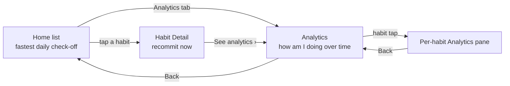
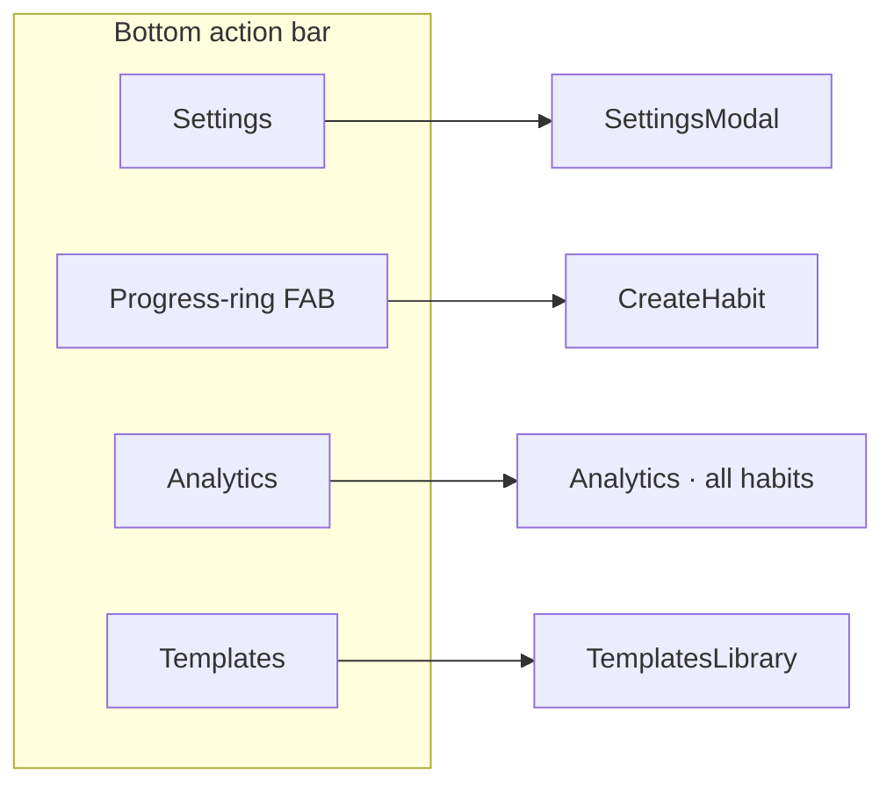
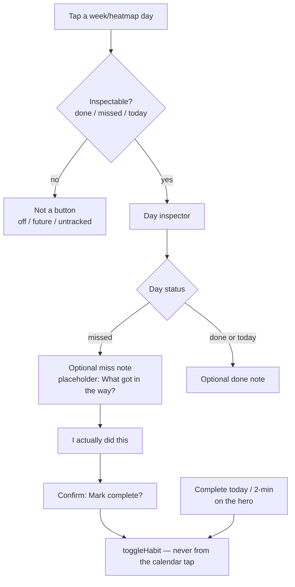
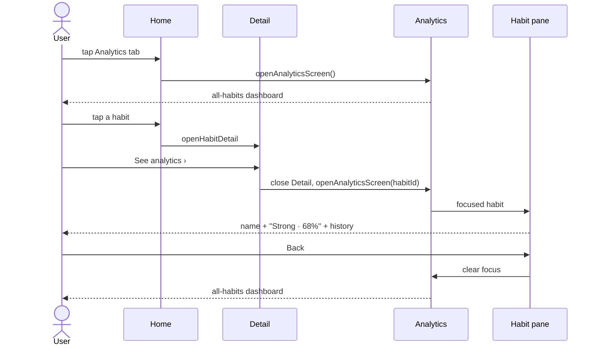
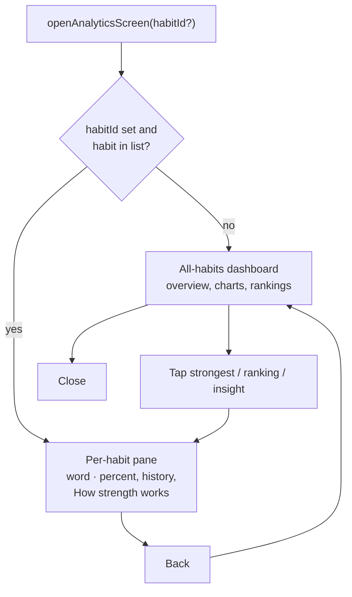

# Habit Detail as a recommitment surface

**Date:** 12 Aug 2026
**Status:** Signed product (Kimi K3 + Codex GPT-5.6 Sol) · implementation may lag this spec
**Mock:** `.superdesign/design_iterations/habit_detail_improvements_1.html`

Habit Detail is not a dashboard. It is the place you go to **recommit right now**. Analytics is where you go to ask **how am I doing over time**.

---

## Surfaces

| Surface | Job |
| --- | --- |
| Home list | Fastest daily check-off |
| Habit Detail | Smallest valid action now, miss recovery, enough progress to keep going |
| Analytics | How am I doing over time (all habits, or one habit’s history) |

---

## Signed rules

1. **Date-state trust.** `createdAt` is respected. Off / future / pre-creation days are not tappable. A calendar tap **inspects**; it does not silently toggle.
2. **Concrete 2-minute CTA.** Use saved/template `startSmallVersion`, never the cue (`cue = when, not what`). Fallback: `Do the 2-minute version — it counts`. With a tiny action: `${tiny} — it counts`.
3. **Optional miss note.** Status stays missed. A note must **never** create a completion. Completing a missed day is explicit: **I actually did this** + confirm.
4. **Hero strength = level word only** on Detail (Starting Out / Building / Growing / Strong / Unbreakable). Ring fill may stay. The percent lives on Analytics.
5. **Delete “View history ›”.** Replace with **See analytics ›**, which closes Detail and opens that habit’s Analytics pane.
6. **Analytics is a first-class bottom-bar tab**, shipped with habit-tap wiring. Strongest-habit and ranking taps open the per-habit Analytics pane, **not** Detail.

### Refused

Invented science on Detail · streak freeze · more charts on Detail · claiming retention without data.

---

## Home bar

Four slots, left to right: **Settings · FAB · Analytics · Templates**.

Analytics is not shown as selected on Home. Lucide `BarChart3`.

---

## Habit Detail

Recommitment stack, top to bottom:

1. Hero — name, schedule, **word-only** strength dial, Complete today, 2-minute CTA
2. Recovery copy if yesterday was a scheduled miss (and the habit already existed)
3. This week (Monday-first) — inspectable dots only
4. Noticing
5. Your month heatmap — inspect, not toggle — footer **See analytics ›**

Hero Complete today / 2-minute still toggle **today**. That is the fast path.

### Day inspector vs complete

Inspectable states: **done**, **missed**, **today**.  
Not buttons: **off** (unscheduled), **upcoming/future**, **untracked** (before `createdAt`).

Saving a tracking note inserts `completed: false` when no row exists. It never sets `completed: true`.

### Strength on Detail vs Analytics

| Place | Shows |
| --- | --- |
| Detail hero dial | Level word only (Starting Out → Unbreakable). Ring fill OK. |
| Analytics pane subtitle | `Starting Out · 12%` |
| Analytics pane | Optional **How strength works** — existing explainer, not new science |

Levels (0–100): 0–20 Starting Out · 20–40 Building · 40–60 Growing · 60–80 Strong · 80–101 Unbreakable.

---

## Analytics

Opened as a full-screen modal (same pattern as Templates).

- Bottom-bar Analytics → all-habits dashboard (no focused habit)
- **See analytics ›** from Detail → close Detail, open Analytics focused on that habit
- Strongest / weakest / rankings / weekly-insight habit tap → that habit’s pane, **not** Detail
- Pane Back → all-habits dashboard (scroll position restored by staying mounted)
- Dashboard Close → Home

History that used to live on Detail moves here: stats, year glance, month grids, calendar / strength / goal disclosure.

Calendar taps on the Analytics pane are **view-only** (no toggle).

---

## File map

| Area | Files |
| --- | --- |
| Date trust | `insights/habitStartDate.ts`, `insights/missedYesterday.ts`, `ThisWeekCard/useThisWeek.ts`, `MonthHeatmapCard/useMonthHeatmap.ts` |
| Inspect, don’t toggle | `WeekDayDot.tsx`, `HeatmapGrid.tsx`, `DayInspector/` |
| 2-min CTA | `DetailHeroBanner.utils.ts` → `twoMinuteCtaLabel()`; schema `habits.startSmallVersion`; copied on template import |
| Strength word | `HeroDialCenter.tsx`, `HeroStrengthDial.tsx` |
| See analytics | `MonthHeatmapCard.tsx` → `HabitsModals.helpers.ts` closes Detail and opens Analytics |
| Bottom bar | `BottomActionBar.tsx` — Settings, FAB, Analytics, Templates |
| Analytics modal | `useModalVisibilityState.ts`, `AnalyticsModalSection.tsx` |
| Per-habit pane | `AnalyticsScreen/components/AnalyticsHabitPane.tsx`, `useAnalyticsFocus.ts` |
| Notes never complete | `convex/habits/updateTrackingNote.ts` + `updateTrackingNoteGuard({ isFuture })` |

---

## Live facts (do not regress)

- Week strip is **Monday-first** (`weekStartsOn: 1`).
- Heatmap is a rolling 28 days ending Sunday of this week.
- `completedDates` already filters `entry.completed` — incomplete note rows must not count as completions.
- Toggle already patches existing tracking rows, so **I actually did this** on a miss-note row flips `completed: true`.
- Home list remains the fastest daily check-off. Detail does not replace it.
