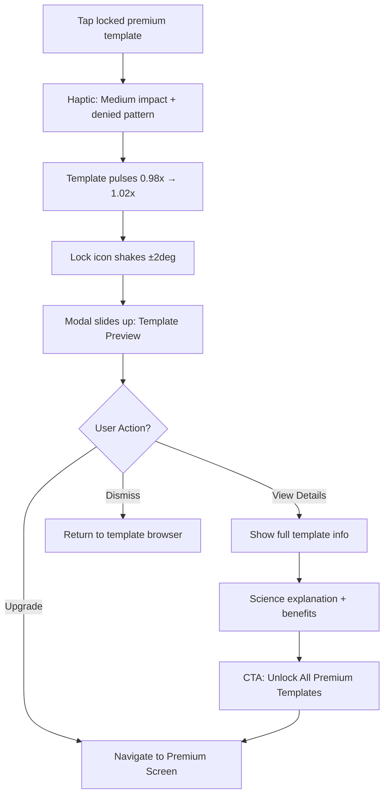
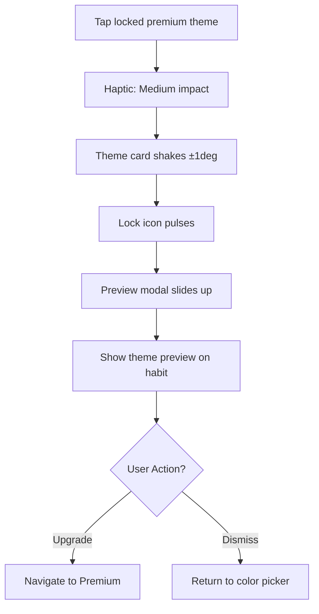
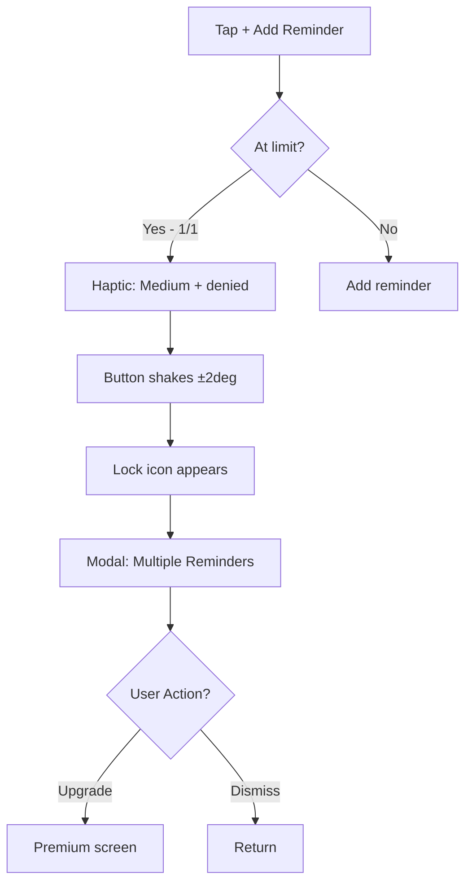
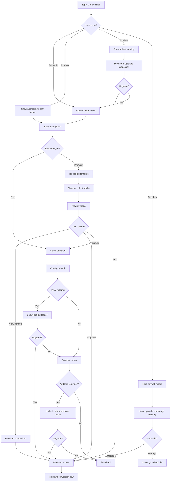

# Create Habit Screen - Monetization UX Specification

_Generated on 2025-11-02 by Sally (UX Expert)_
_For: Jane | Project: Habit Tracking App_

---

## Executive Summary

This specification defines UX/UI improvements for the Create Habit screen specifically focused on monetization touchpoints and premium conversion. Building on the existing template system and gamification framework, these enhancements create natural upgrade moments that feel valuable rather than restrictive.

**Focus Areas:**
1. Premium Template Showcase & Gating
2. Advanced Customization Tiers (Colors, Emojis, Themes)
3. Smart Habit Limits with Soft Paywalls
4. AI-Powered Suggestions (Premium Feature)
5. Multi-Reminder System (Free vs Premium)
6. Template Science Deep-Dives (Premium Content)

**Strategic Goals:**
- Showcase premium value early in user journey
- Convert 8-12% of template browsers to premium
- Create FOMO without frustration
- Maintain free tier usability

---

## 1. Current State Analysis

### Existing Create Habit Components

**Current Flow:**
```
Open Create Habit Modal
├─ Header (Save/Cancel)
├─ Template Browser (Collapsible)
│   ├─ Template Hero
│   ├─ Category Filters
│   └─ Template List (with Science icons)
├─ Habit Preview
├─ Habit Name Field
├─ Emoji Picker
├─ Color Picker Section
└─ Reminder Section
```

**Strengths:**
- ✅ Clean, intuitive hierarchy
- ✅ Template system already built
- ✅ Science credibility with microscope icons
- ✅ Good visual preview

**Monetization Gaps:**
- ❌ No premium template differentiation
- ❌ All colors/emojis freely available
- ❌ No limit enforcement UI
- ❌ No AI suggestions or smart features
- ❌ Single reminder only (no premium tier)
- ❌ Template science always free

---

## 2. Monetization Touchpoints Design

### Touchpoint 1: Premium Template Showcase

**Location:** Template Browser section
**Trigger:** User opens template browser
**Goal:** Create desire for premium templates without blocking free ones

#### Visual Design

**Free Template (Current):**
```
┌─────────────────────────────────────┐
│ 🌅 Morning Routine                  │
│ Start your day with energy          │
│                           🔬  →     │
└─────────────────────────────────────┘
```

**Premium Template (New Design):**
```
┌─────────────────────────────────────┐
│ ✨ Advanced Sleep Optimizer    PRO │
│ Science-backed 8-week program       │
│ 🔒 Upgrade to unlock        🔬  →  │
└─────────────────────────────────────┘
 ↑                             ↑
Gold shimmer               Lock icon
```

#### Component Specification

```typescript
interface TemplateCardProps {
  template: HabitTemplate;
  isPremium: boolean;
  isLocked: boolean; // true if premium + user is free
  onSelect: () => void;
  onViewScience: () => void;
}

// Visual States
states: {
  default: 'white bg, clear interaction',
  premium_locked: 'gold shimmer overlay, lock icon, blur 4px',
  premium_unlocked: 'gold accent border, ✨ badge',
  hover: 'scale 1.02x, shadow increase'
}
```

#### Interaction Flow

**Free User Taps Locked Premium Template:**


**Premium Upsell Modal Content:**
```
┌─────────────────────────────────────────┐
│  ✨ Advanced Sleep Optimizer           │
│                                         │
│  Designed by sleep scientists at...    │
│                                         │
│  📚 What's Included:                    │
│  • 8-week progressive program          │
│  • Optimal timing recommendations      │
│  • Sleep quality metrics               │
│  • Research-backed milestones          │
│                                         │
│  💎 Premium Benefits:                   │
│  • Access to 20+ advanced templates    │
│  • Full science explanations           │
│  • AI-powered customization            │
│  • Multi-reminder scheduling           │
│                                         │
│  [Start 7-Day Free Trial]              │
│  [Maybe Later]                          │
└─────────────────────────────────────────┘
```

#### Animation Specifications

**Shimmer Effect (Premium Badge):**
```javascript
// Subtle gold shimmer on premium templates
const shimmerAnimation = {
  duration: 2000,
  loop: true,
  keyframes: [
    { offset: 0, opacity: 0.3, translateX: -100 },
    { offset: 0.5, opacity: 0.8, translateX: 0 },
    { offset: 1, opacity: 0.3, translateX: 100 }
  ],
  gradient: 'linear-gradient(90deg, transparent, rgba(255,215,0,0.3), transparent)'
}
```

**Lock Icon Shake (On Tap):**
```javascript
// Denied interaction feedback
const lockShake = {
  duration: 300,
  cycles: 2,
  amplitude: 2, // degrees
  haptic: 'medium + light (2x)',
  easing: 'easeInOut'
}
```

---

### Touchpoint 2: Habit Limit Soft Paywall

**Location:** Top of Create Habit Modal
**Trigger:** User at or near habit limit (3 for free, unlimited for premium)
**Goal:** Convert users before they hit hard limit

#### Visual Design States

**State 1: Approaching Limit (2/3 Habits)**
```
┌─────────────────────────────────────┐
│ Create Habit              2/3 🎯    │ ← Badge shows count
│ ─────────────────────────────────── │
│ 💡 Tip: Track unlimited habits      │
│    with Premium                  → │ ← Subtle suggestion
└─────────────────────────────────────┘
```

**State 2: At Limit (3/3 Habits - Last Free)**
```
┌─────────────────────────────────────┐
│ Create Your Last Free Habit  3/3 ⚠️ │ ← Warning color
│ ─────────────────────────────────── │
│ ⭐ This is your last free slot!     │
│    Upgrade for unlimited habits  →  │ ← More prominent CTA
└─────────────────────────────────────┘
```

**State 3: Over Limit (Blocked - Hard Paywall)**
```
┌─────────────────────────────────────┐
│ ✨ Unlock Unlimited Habits          │
│ ─────────────────────────────────── │
│  You've created 3 amazing habits!   │
│  Ready to build more?               │
│                                     │
│  Free: 3 active habits              │
│  Pro: Unlimited habits ♾️           │
│                                     │
│  [Start 7-Day Free Trial]           │
│  [View Premium Benefits]            │
│  [Manage Existing Habits]           │
└─────────────────────────────────────┘
```

#### Component Specification

```typescript
interface HabitLimitBannerProps {
  current: number;
  max: number; // 3 for free, Infinity for premium
  isPremium: boolean;
  onUpgrade: () => void;
}

// Visual States
states: {
  hidden: current < max - 1,
  approaching: current === max - 1, // 2/3
  at_limit: current === max, // 3/3, last free
  over_limit: current >= max && !isPremium // Hard block
}
```

#### Animation & Interaction

**Approaching Limit Animation:**
```javascript
// Gentle pulsing attention
const approachingPulse = {
  duration: 2000,
  loop: true,
  scale: [1.0, 1.02, 1.0],
  opacity: [0.7, 1.0, 0.7],
  easing: 'easeInOut'
}
```

**At Limit Interaction:**
```
User taps anywhere on banner:
1. Haptic: Medium impact
2. Expand banner to show full message (300ms spring)
3. Show premium comparison:
   Free: "3 habits" | Premium: "Unlimited ♾️"
4. CTA button pulses gently
```

**Over Limit (Hard Paywall):**
```
Modal takes over entire Create Habit screen:
1. Background blurs habit creation form
2. Center modal slides up (400ms spring)
3. Confetti particles fall gently (optional)
4. Premium benefits list animates in (100ms stagger)
5. CTA button has gradient shimmer
6. Haptic on modal appearance: Medium impact
```

---

### Touchpoint 3: Advanced Color Customization

**Location:** Color Picker Section
**Current State:** Basic color palette (8-10 colors)
**Enhancement:** Premium color themes, gradients, seasonal palettes

#### Visual Design

**Free Color Picker (Current):**
```
Color
[🔴][🟠][🟡][🟢][🔵][🟣][⚫][⚪] Custom
```

**Premium Color Picker (Enhanced):**
```
Color
[🔴][🟠][🟡][🟢][🔵][🟣][⚫][⚪]

✨ Premium Themes
[Gradient 1] [Gradient 2] [Seasonal] 🔒
  ↑              ↑             ↑
Locked with gold shimmer effect
```

#### Component Specification

```typescript
interface ColorPickerSectionProps {
  selectedColor: string;
  onSelectColor: (color: string) => void;
  isPremium: boolean;
}

// Premium Color Themes
premiumThemes: [
  {
    id: 'sunset_gradient',
    name: 'Sunset Gradient',
    colors: ['#FF6B6B', '#FFA500'],
    type: 'gradient',
    locked: !isPremium
  },
  {
    id: 'ocean_breeze',
    name: 'Ocean Breeze',
    colors: ['#667EEA', '#764BA2'],
    type: 'gradient',
    locked: !isPremium
  },
  {
    id: 'seasonal_spring',
    name: 'Spring Blossom',
    colors: ['#FA709A', '#FEE140'],
    type: 'seasonal',
    locked: !isPremium
  }
]
```

#### Interaction Flow

**Free User Taps Locked Theme:**


**Preview Modal:**
```
┌─────────────────────────────────────┐
│  🌅 Sunset Gradient Theme           │
│                                     │
│  [Preview of habit with gradient]   │
│  ┌─────────────────────┐            │
│  │ 🏃 Morning Run      │            │
│  │ ████████░░ 67% 🔥 12│            │
│  └─────────────────────┘            │
│                                     │
│  ✨ Premium Feature                 │
│  Unlock gradient themes, seasonal   │
│  palettes, and custom color combos  │
│                                     │
│  [Unlock Premium Themes]            │
│  [Try Another Preview]              │
└─────────────────────────────────────┘
```

---

### Touchpoint 4: AI-Powered Habit Suggestions (Premium)

**Location:** Habit Name Field
**Trigger:** User types habit name
**Goal:** Show AI value proposition early

#### Visual Design

**Free User Experience:**
```
Habit Name
┌─────────────────────────────────────┐
│ Morning run                         │
└─────────────────────────────────────┘

✨ AI can suggest optimal times
   and improve this habit name        🔒
   [Unlock AI Features]
```

**Premium User Experience:**
```
Habit Name
┌─────────────────────────────────────┐
│ Morning run                         │
└─────────────────────────────────────┘

🤖 AI Suggestions:
• "30-min Morning Cardio" (more specific)
• Best time: 6:30 AM (based on patterns)
• Pair with: "Drink water" habit
[Use Suggestion]  [Dismiss]
```

#### Component Specification

```typescript
interface AIHabitSuggestionsProps {
  habitName: string;
  isPremium: boolean;
  onApplySuggestion: (suggestion: HabitSuggestion) => void;
  onUpgrade: () => void;
}

interface HabitSuggestion {
  improvedName?: string;
  optimalTime?: Date;
  pairingHabits?: string[];
  reasoning: string;
}
```

#### Animation & Interaction

**Free User - AI Teaser:**
```javascript
// Subtle animation to draw attention
const aiTeaserAnimation = {
  delay: 2000, // After user starts typing
  entrance: 'slideInFromBottom',
  duration: 300,
  spring: { damping: 0.8, stiffness: 200 }
}

// Locked state shimmer
const lockedShimmer = {
  duration: 2000,
  loop: true,
  gradient: 'gold shimmer overlay'
}
```

**Tap Locked AI Feature:**
```
1. Haptic: Medium impact
2. AI card expands (300ms spring)
3. Modal shows AI benefits:
   • Habit name optimization
   • Optimal timing suggestions
   • Smart habit pairing
   • Success predictions
4. CTA: "Unlock AI Features" → Premium screen
```

**Premium User - AI Suggestions Appear:**
```
1. User types habit name
2. After 500ms pause, AI analyzes
3. Suggestion card slides up (400ms)
4. Haptic: Selection feedback
5. Suggestions animate in (100ms stagger)
6. Tap suggestion → Applies with smooth transition
```

---

### Touchpoint 5: Multi-Reminder System

**Location:** Reminder Section
**Current State:** Single reminder toggle + time picker
**Enhancement:** Premium users get multiple reminders per habit

#### Visual Design

**Free User (Single Reminder):**
```
Reminders
┌─────────────────────────────────────┐
│ Enable Reminders        [Toggle ON] │
│ Time: 8:00 AM                    ⏰ │
└─────────────────────────────────────┘

💡 Pro Tip: Set multiple reminders
   throughout the day               🔒
   [Upgrade to Premium]
```

**Premium User (Multiple Reminders):**
```
Reminders
┌─────────────────────────────────────┐
│ Morning reminder         [ON] 8:00  │
│ Midday check-in          [ON] 12:00 │
│ Evening reminder         [OFF] 6:00 │
│                                     │
│ [+ Add Another Reminder]            │
└─────────────────────────────────────┘

✨ Premium: Unlimited reminders active
```

#### Component Specification

```typescript
interface ReminderSectionProps {
  reminders: Reminder[];
  maxReminders: number; // 1 for free, unlimited for premium
  isPremium: boolean;
  onAddReminder: () => void;
  onToggleReminder: (id: string) => void;
  onUpdateTime: (id: string, time: Date) => void;
}

interface Reminder {
  id: string;
  label: string;
  time: Date;
  enabled: boolean;
}
```

#### Interaction Flow

**Free User Taps "+ Add Reminder":**


**Premium Benefits Modal:**
```
┌─────────────────────────────────────┐
│  ⏰ Smart Reminders (Premium)       │
│                                     │
│  Never miss a habit with:           │
│  • Multiple reminders per habit     │
│  • Custom reminder labels           │
│  • Adaptive timing (AI learns)      │
│  • Smart snooze options             │
│                                     │
│  Free: 1 reminder per habit         │
│  Pro: Unlimited reminders ♾️        │
│                                     │
│  [Upgrade to Premium]               │
│  [Learn More]                       │
└─────────────────────────────────────┘
```

---

### Touchpoint 6: Template Science Deep-Dives

**Location:** Template Science Modal (microscope icon)
**Current State:** Basic template information
**Enhancement:** Lock detailed science content behind premium

#### Visual Design

**Free User - Limited Science:**
```
┌─────────────────────────────────────┐
│  🌅 Morning Routine                 │
│  ─────────────────────────────────  │
│  Why It Works:                      │
│  Morning routines help establish... │
│  [Read more - 50% shown]            │
│                                     │
│  ✨ Unlock Full Science Report      │
│  • Research citations               │
│  • Success statistics               │
│  • Expert recommendations           │
│  • Personalized insights            │
│                                     │
│  [View Premium Science]         🔒  │
└─────────────────────────────────────┘
```

**Premium User - Full Science:**
```
┌─────────────────────────────────────┐
│  🌅 Morning Routine                 │
│  ─────────────────────────────────  │
│  🔬 The Science                     │
│  Full explanation with citations... │
│  [Expand/Collapse sections]         │
│                                     │
│  📊 Success Data                    │
│  • 87% report increased energy      │
│  • Average habit formation: 23 days │
│                                     │
│  💡 Expert Tips                     │
│  • Start with 5-minute version      │
│  • Link to existing wake-up time   │
│                                     │
│  📚 Research Citations              │
│  • Journal of Applied Psychology... │
└─────────────────────────────────────┘
```

#### Component Specification

```typescript
interface TemplateScienceModalProps {
  template: HabitTemplate;
  isPremium: boolean;
  visible: boolean;
  onClose: () => void;
  onUpgrade: () => void;
}

// Science content tiers
scienceContent: {
  free: {
    summary: string; // 2-3 sentences
    preview: string; // First 50% of full content
  },
  premium: {
    fullExplanation: string;
    researchCitations: Citation[];
    successStatistics: Stat[];
    expertTips: string[];
    personalizedInsights: string;
  }
}
```

#### Interaction & Animation

**Free User Views Science:**
```
1. Tap microscope icon on template
2. Modal slides up (400ms spring)
3. Free content fades in (200ms)
4. Blur overlay appears at cutoff point
5. "Unlock Full Science" CTA pulses gently
6. Haptic: Selection feedback
```

**Scroll to Locked Content:**
```
1. User scrolls to bottom of free content
2. Blur intensifies (300ms)
3. Unlock button scales up (1.0 → 1.05x)
4. Gold shimmer animation plays
5. Haptic: Medium impact
6. Sticky "Upgrade" button appears at bottom
```

---

## 3. User Flows

### Flow 1: Free User Creates Habit → Discovers Premium Value



### Flow 2: Premium User Creates Habit → Enhanced Experience

```mermaid
flowchart TD
    A[Tap + Create Habit] --> B[Open Create Modal - Premium UI]
    B --> C[Browse all templates unlocked]
    C --> D[Select any template]
    D --> E[Full science explanation available]
    E --> F[Configure habit]

    F --> G[AI suggestions appear automatically]
    G --> H{Apply AI suggestion?}
    H -->|Yes| I[Auto-fill optimized name/time]
    H -->|No| J[Continue manual]

    I --> K[Select premium gradient theme]
    J --> K

    K --> L[Add multiple reminders]
    L --> M[Morning: 8:00 AM]
    M --> N[Midday: 12:00 PM]
    N --> O[Evening: 6:00 PM]

    O --> P[Premium celebration animation]
    P --> Q[Habit created with ✨ badge]
    Q --> R[Subtle "Premium features used" toast]
```

---

## 4. Visual Design System

### Color Palette - Monetization Accents

**Premium Indicators:**
- Premium Gold: `#FFD700`
- Premium Gradient: `linear-gradient(135deg, #FFD700 0%, #FFA500 100%)`
- Lock Icon: `#9CA3AF` (Gray 400)
- Shimmer Overlay: `rgba(255, 215, 0, 0.2)` to `rgba(255, 215, 0, 0.6)`

**State Colors:**
- Approaching Limit: `#F59E0B` (Amber 500)
- At Limit: `#EF4444` (Red 500)
- Premium Unlocked: `#10B981` (Green 500)

**Backgrounds:**
- Free Content: `#FFFFFF`
- Premium Content: `#FFFBEB` (Amber 50) - subtle premium tint
- Locked Overlay: `rgba(0, 0, 0, 0.05)` with `blur(4px)`

### Typography - Monetization Elements

**Premium Badges:**
```css
.premium-badge {
  font-size: 10px;
  font-weight: 700;
  letter-spacing: 0.5px;
  text-transform: uppercase;
  color: #B45309; /* Amber 700 */
  background: linear-gradient(135deg, #FFD700, #FFA500);
  padding: 2px 8px;
  border-radius: 8px;
}
```

**Limit Counter:**
```css
.habit-limit-counter {
  font-size: 14px;
  font-weight: 600;
  color: #F59E0B; /* Amber 500 */
  background: rgba(245, 158, 11, 0.1);
  padding: 4px 12px;
  border-radius: 16px;
}
```

### Iconography

**Lock Icon (Locked Premium):**
- Size: 16x16px
- Color: `#9CA3AF`
- Position: Top-right corner of locked items
- Animation: Shake on tap (±2deg, 2 cycles)

**Sparkle Icon (Premium Feature):**
- Emoji: `✨` or Lucide `Sparkles` icon
- Color: `#FFD700`
- Animation: Gentle pulsing (0.95x → 1.05x, 2s cycle)

---

## 5. Animation Specifications

### Shimmer Effect (Premium Items)

```javascript
const premiumShimmer = {
  name: 'shimmer',
  duration: 2000,
  loop: true,
  easing: 'linear',
  keyframes: {
    '0%': {
      backgroundPosition: '-100% 0'
    },
    '100%': {
      backgroundPosition: '200% 0'
    }
  },
  background: 'linear-gradient(90deg, transparent 0%, rgba(255,215,0,0.4) 50%, transparent 100%)',
  backgroundSize: '200% 100%'
}
```

### Lock Shake Animation (Denied Access)

```javascript
const lockShake = {
  name: 'denyShake',
  duration: 300,
  easing: 'easeInOut',
  keyframes: [
    { offset: 0, rotate: '0deg' },
    { offset: 0.25, rotate: '2deg' },
    { offset: 0.5, rotate: '-2deg' },
    { offset: 0.75, rotate: '2deg' },
    { offset: 1, rotate: '0deg' }
  ],
  haptic: {
    pattern: ['medium', { delay: 50, type: 'light' }, { delay: 100, type: 'light' }]
  }
}
```

### Premium Modal Entrance

```javascript
const premiumModalEntrance = {
  name: 'modalSlideUp',
  duration: 400,
  easing: 'spring',
  springConfig: {
    damping: 0.8,
    stiffness: 200
  },
  keyframes: {
    from: {
      translateY: '100%',
      opacity: 0
    },
    to: {
      translateY: '0%',
      opacity: 1
    }
  },
  haptic: 'medium'
}
```

### Upgrade Button Pulse (CTA Attention)

```javascript
const upgradePulse = {
  name: 'ctaPulse',
  duration: 2000,
  loop: true,
  easing: 'easeInOut',
  keyframes: [
    { offset: 0, scale: 1.0, boxShadow: '0 4px 12px rgba(255,215,0,0.2)' },
    { offset: 0.5, scale: 1.02, boxShadow: '0 6px 20px rgba(255,215,0,0.4)' },
    { offset: 1, scale: 1.0, boxShadow: '0 4px 12px rgba(255,215,0,0.2)' }
  ]
}
```

---

## 6. Accessibility Requirements

### Screen Reader Announcements

**Premium Template:**
```
"Advanced Sleep Optimizer template. Premium feature. Tap to preview or upgrade to unlock."
```

**Habit Limit:**
```
"You have 2 of 3 free habits. Creating one more free habit available."
"You have created your last free habit. Upgrade to Premium for unlimited habits."
"Habit limit reached. Upgrade to Premium to create more habits."
```

**Locked Color Theme:**
```
"Sunset Gradient theme. Premium feature. Tap to preview."
```

### Reduced Motion Alternatives

**When `prefers-reduced-motion: true`:**
- Shimmer effects: Replace with static gold tint
- Lock shake: Replace with simple scale (1.0 → 1.05x → 1.0)
- Modal entrance: Replace spring with simple fade (300ms)
- Pulse animations: Disable entirely

### Touch Target Sizing

**All interactive elements:**
- Minimum: 44x44px (iOS HIG)
- Lock icon buttons: 48x48px (extra padding around 16x16 icon)
- Premium CTA buttons: Full width, 56px height

---

## 7. Implementation Checklist

### Phase 1: Template Monetization (Week 1)

- [ ] Add `isPremium` field to template schema
- [ ] Create premium template data (10-15 templates)
- [ ] Implement `PremiumTemplateCard` component
  - [ ] Gold shimmer overlay
  - [ ] Lock icon in corner
  - [ ] Blur effect (4px)
- [ ] Build Template Preview Modal
  - [ ] Full template details
  - [ ] Premium benefits list
  - [ ] "Unlock Premium Templates" CTA
- [ ] Add tap interaction (shake + modal)
- [ ] Test with VoiceOver/TalkBack

### Phase 2: Habit Limit Soft Paywall (Week 2)

- [ ] Add habit count tracking
- [ ] Implement `HabitLimitBanner` component
  - [ ] Approaching state (2/3)
  - [ ] At limit state (3/3)
  - [ ] Color-coded warnings
- [ ] Create Hard Paywall Modal (over limit)
  - [ ] Feature comparison
  - [ ] "Manage Existing Habits" option
  - [ ] Premium CTA
- [ ] Add animations (pulse, expansion)
- [ ] Test edge cases (exactly at limit)

### Phase 3: Premium Customization (Week 3)

- [ ] Design 8-10 premium color themes
  - [ ] Gradients
  - [ ] Seasonal palettes
  - [ ] Custom combinations
- [ ] Implement `PremiumColorPicker` component
  - [ ] Locked theme cards with shimmer
  - [ ] Preview modal
  - [ ] Live habit preview
- [ ] Add emoji upgrade teaser (future: custom uploads)
- [ ] Test theme application on habits

### Phase 4: AI Features Teaser (Week 4)

- [ ] Design AI suggestion UI
- [ ] Create `AIFeatureTeaser` component (locked state)
  - [ ] Appears after user types
  - [ ] Shows locked AI benefits
  - [ ] Premium CTA
- [ ] Build Premium AI Suggestions (actual feature)
  - [ ] Name optimization
  - [ ] Optimal time suggestions
  - [ ] Habit pairing
- [ ] Add animations (slide-in, shimmer)
- [ ] A/B test AI teaser copy

### Phase 5: Multi-Reminder System (Week 5)

- [ ] Update reminder schema (array support)
- [ ] Implement `MultiReminderSection` component
  - [ ] Free: 1 reminder
  - [ ] Premium: Unlimited
  - [ ] "+ Add Reminder" button
- [ ] Create Premium Reminders Modal
  - [ ] Benefits list
  - [ ] Upgrade CTA
- [ ] Add locked state interaction
- [ ] Test reminder scheduling

### Phase 6: Template Science Paywall (Week 6)

- [ ] Extend `TemplateScienceModal`
  - [ ] Free: Summary + 50% preview
  - [ ] Premium: Full content
  - [ ] Blur overlay at cutoff
- [ ] Add detailed science content
  - [ ] Research citations
  - [ ] Success statistics
  - [ ] Expert tips
- [ ] Implement scroll-to-unlock interaction
- [ ] Test content formatting

### Phase 7: Polish & Optimization (Week 7)

- [ ] Refine all animations (60fps target)
- [ ] Implement reduced motion alternatives
- [ ] Accessibility audit
  - [ ] Screen reader testing
  - [ ] Color contrast verification
  - [ ] Touch target sizing
- [ ] Performance optimization
  - [ ] Lazy load premium modals
  - [ ] Optimize shimmer animations
- [ ] A/B test variants (copy, timing, placement)

---

## 8. Success Metrics & A/B Testing

### Key Metrics to Track

**Conversion Funnel:**
1. Create Habit Modal Opened
2. Template Browser Opened
3. Premium Template Tapped
4. Premium Modal Viewed
5. Upgrade Button Clicked
6. Trial Started / Purchase Completed

**Engagement Metrics:**
- % users who tap locked premium templates
- % users who reach habit limit
- Average time spent in premium preview modals
- Dismissal rate of premium CTAs
- Return rate after dismissing (try again later?)

### A/B Test Ideas

**Test 1: Shimmer Intensity**
- Variant A: Subtle shimmer (0.2 → 0.4 opacity)
- Variant B: Bold shimmer (0.3 → 0.7 opacity)
- Measure: Click-through rate on premium templates

**Test 2: Habit Limit Warning Timing**
- Variant A: Show at 2/3 habits
- Variant B: Show at 3/3 only
- Measure: Upgrade conversion rate

**Test 3: AI Feature Teaser Copy**
- Variant A: "AI can improve this habit"
- Variant B: "Get AI-powered suggestions"
- Variant C: "Let AI optimize for you"
- Measure: CTA click rate, upgrade rate

**Test 4: Premium Modal CTA Text**
- Variant A: "Start 7-Day Free Trial"
- Variant B: "Unlock Premium Features"
- Variant C: "Try Premium Free for 7 Days"
- Measure: Trial start rate

---

## 9. Next Steps

### Immediate Actions

1. **Review with stakeholders** - Get buy-in on approach
2. **Prioritize features** - Which touchpoints ship in MVP?
3. **Design mockups** - Create Figma screens for all states
4. **Technical planning** - Backend changes needed?
5. **Content creation** - Write premium template science content

### Design Handoff

**Required Deliverables:**
- [ ] Figma file with all screen states
- [ ] Component library (premium variants)
- [ ] Animation prototypes (Lottie or Figma)
- [ ] Copy deck (all CTA text, modal content)
- [ ] Accessibility documentation
- [ ] A/B test variants specification

### Development Handoff

**Technical Requirements:**
- [ ] Update Convex schema (template.isPremium, user.habitCount)
- [ ] Implement premium feature gating logic
- [ ] Build all monetization components
- [ ] Add analytics tracking events
- [ ] Configure A/B testing framework (Statsig, Optimizely, etc.)
- [ ] Test in-app purchase integration

---

## Appendix A: Component Reference

### Component Hierarchy

```
CreateHabitModal
├─ HabitLimitBanner (new)
│   ├─ LimitCounter
│   └─ UpgradeCTA
├─ ModalHeader
├─ TemplateBrowser
│   ├─ TemplateHero
│   ├─ CategoryFilters
│   └─ TemplateList
│       ├─ FreeTemplateCard
│       └─ PremiumTemplateCard (new)
│           ├─ ShimmerOverlay
│           ├─ LockIcon
│           └─ PremiumBadge
├─ PremiumTemplatePreviewModal (new)
│   ├─ TemplateDetails
│   ├─ BenefitsList
│   └─ UpgradeCTA
├─ HabitPreview
├─ HabitNameField
│   └─ AIFeatureTeaser (new)
├─ EmojiPicker
├─ ColorPickerSection
│   ├─ BasicColors
│   └─ PremiumThemes (new)
│       └─ LockedThemeCard
├─ ReminderSection
│   ├─ SingleReminder (free)
│   └─ MultiReminderList (premium)
│       ├─ ReminderItem
│       └─ AddReminderButton
└─ HardLimitPaywallModal (new)
    ├─ FeatureComparison
    ├─ PricingCards
    └─ ManageHabitsOption
```

### New Component Props

```typescript
// PremiumTemplateCard.tsx
interface PremiumTemplateCardProps {
  template: HabitTemplate & { isPremium: boolean };
  isLocked: boolean;
  onTap: () => void;
  onViewScience: () => void;
}

// HabitLimitBanner.tsx
interface HabitLimitBannerProps {
  current: number;
  max: number;
  state: 'hidden' | 'approaching' | 'at_limit';
  onUpgrade: () => void;
}

// AIFeatureTeaser.tsx
interface AIFeatureTeaserProps {
  habitName: string;
  isPremium: boolean;
  onUnlock: () => void;
}

// PremiumColorTheme.tsx
interface PremiumColorThemeProps {
  theme: ColorTheme;
  isLocked: boolean;
  onTap: () => void;
}

// HardLimitPaywallModal.tsx
interface HardLimitPaywallModalProps {
  visible: boolean;
  currentHabits: number;
  onUpgrade: () => void;
  onManageHabits: () => void;
  onDismiss: () => void;
}
```

---

## Appendix B: Copy Deck

### Premium Template CTAs

**Template Card Badge:**
- "PRO"
- "PREMIUM"
- "✨ ELITE"

**Locked Template Message:**
- "Upgrade to unlock"
- "Premium only"
- "Unlock with Pro"

**Preview Modal Headlines:**
- "Unlock Premium Templates"
- "Get Science-Backed Habits"
- "Upgrade to Access Advanced Templates"

**Preview Modal Body:**
- "Access 20+ expert-designed templates with detailed science explanations and proven success strategies."
- "Join thousands of users who've mastered habits with our premium template library."

### Habit Limit Messages

**Approaching (2/3):**
- "💡 Tip: Track unlimited habits with Premium"
- "Almost there! Unlock unlimited habits →"

**At Limit (3/3):**
- "⚠️ This is your last free slot!"
- "🎯 Last free habit - Upgrade for unlimited"

**Over Limit (Hard Paywall):**
- Headline: "✨ Unlock Unlimited Habits"
- Body: "You've created 3 amazing habits! Ready to build more?"
- Feature Compare: "Free: 3 active habits | Pro: Unlimited habits ♾️"

### AI Feature Teaser

**Free User:**
- "✨ AI can suggest optimal times and improve this habit name"
- "🤖 Let AI optimize your habit (Premium)"
- "Get AI-powered suggestions with Premium →"

**Premium User:**
- "🤖 AI Suggestions:"
- "Based on your patterns, here's what works best:"

### Multi-Reminder

**Locked State:**
- "💡 Pro Tip: Set multiple reminders throughout the day"
- "Premium users get unlimited daily reminders"

**Modal Headline:**
- "⏰ Smart Reminders (Premium)"
- "Never Miss a Habit with Multiple Reminders"

**Modal Body:**
- "Free: 1 reminder per habit | Pro: Unlimited reminders ♾️"

### Color Themes

**Locked Theme:**
- "✨ Premium Themes"
- "Unlock gradient & seasonal palettes"

---

**Document Status:** Complete v1.0
**Last Updated:** 2025-11-02
**Next Review:** After stakeholder feedback
**Contact:** Sally (UX Expert)
