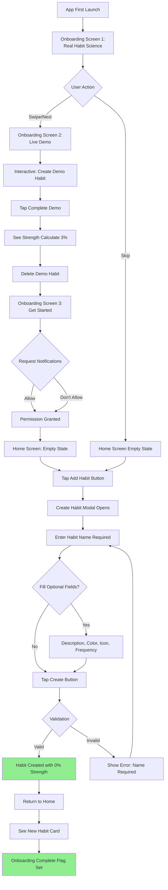
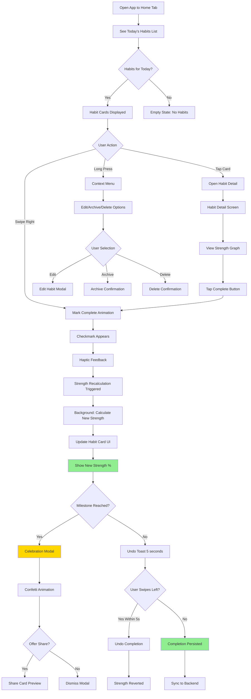
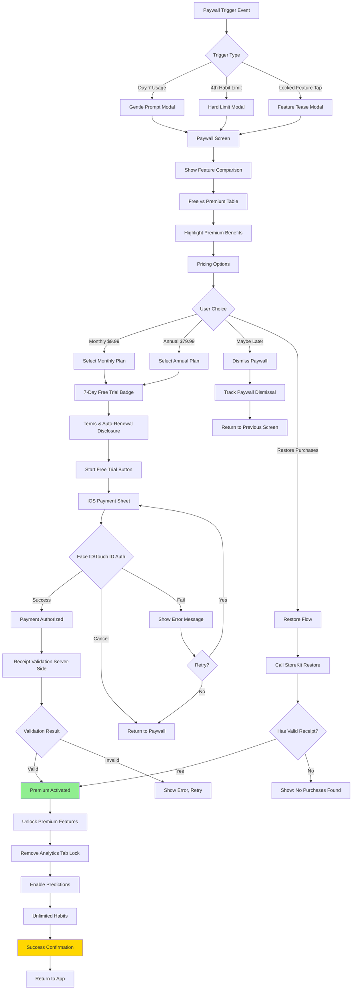
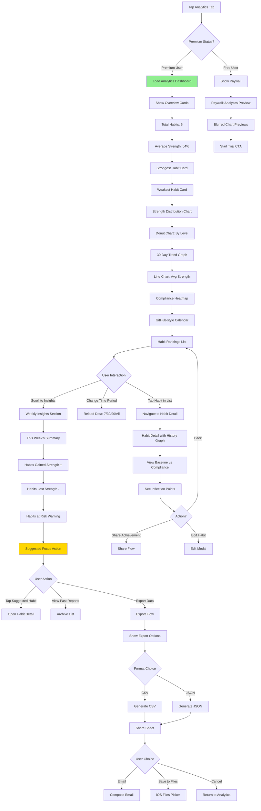
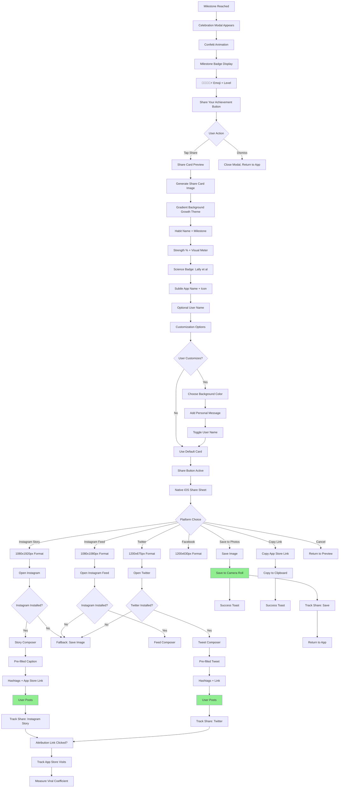

# My Project UX/UI Specification

_Generated on 2025-10-22 by Jane_

## Executive Summary

This UX specification defines the user experience for a premium, science-backed habit tracking mobile app targeting $2,000-$10,000 MRR through subscription revenue. The app differentiates from competitors (Habitica, Productive, Streaks) by combining cutting-edge behavioral science (Zhang et al. 2021, Lally et al. 2010) with elegant, intuitive design - positioning as "Productive meets Atomic Habits."

**Key UX Challenges:**
- Make complex behavioral science (habit strength algorithms, prediction models) accessible and beautiful
- Create premium UX quality that justifies $7-10/month subscription
- Design for solo developer velocity while maintaining design excellence
- Build retention through thoughtful interventions without being annoying
- Enable viral growth through shareable, pride-worthy achievements

**Target Users:** Productivity-focused professionals and behavior change enthusiasts (25-45 years old) who value evidence-based approaches over gamification. These users have likely read "Atomic Habits" and are frustrated with existing apps' superficiality.

**Platform:** iOS mobile app (React Native), designed for one-handed use, thumb-friendly interactions, and premium aesthetic matching Apple's Human Interface Guidelines.

**UX Goals:**
- Onboarding completion >60%
- Daily habit check-in <30 seconds
- Free-to-paid conversion 5-10%
- Monthly churn <5%
- App Store rating >4.5 stars

---

## 1. UX Goals & Principles

### 1.1 Target User Personas

**Primary Persona: Alex - The Science-Seeker**
- **Age:** 32, Product Manager
- **Background:** Read "Atomic Habits", frustrated with gamified trackers
- **Goals:** Build sustainable habits using evidence-based methods, see real progress not arbitrary streaks
- **Pain Points:** Existing apps feel gimmicky, lack scientific rigor, don't explain *why* habits succeed/fail
- **Tech Comfort:** High - early adopter, values premium apps
- **Motivation:** Intrinsic self-improvement, data-driven decision making
- **Key Behavior:** Researches before downloading, willing to pay for quality, shares achievements on social

**Secondary Persona: Morgan - The Pragmatist**
- **Age:** 28, Software Engineer
- **Background:** Tracks 3 habits for 2 weeks, curious about analytics
- **Goals:** Understand habit patterns, prevent failures before they happen
- **Pain Points:** Free apps lack depth, uncertain if premium features worth cost
- **Tech Comfort:** Very high - appreciates good UX and technical sophistication
- **Motivation:** Efficiency and optimization, wants tools that actually work
- **Key Behavior:** Skeptical of subscriptions, needs proof of value during trial

**Tertiary Persona: Jamie - The Committed Builder**
- **Age:** 35, Entrepreneur
- **Background:** 8 habits tracked for 3 months, paying subscriber
- **Goals:** Maintain multiple habits while building new ones
- **Pain Points:** Risk of churn when habits feel "automatic" and app seems unnecessary
- **Tech Comfort:** Moderate-high - values simplicity despite sophistication
- **Motivation:** Achievement and mastery, lifestyle optimization
- **Key Behavior:** Shares successes socially, refers friends, tolerates price for value

### 1.2 Usability Goals

**1. Effortless Daily Use (Efficiency)**
- Habit check-in completes in <30 seconds
- One-handed operation for all core tasks
- Muscle memory develops within 3 days of use
- Zero cognitive load for routine tracking

**2. Immediate Value Recognition (Learnability)**
- New users grasp habit strength concept within onboarding
- First strength increase creates "aha moment" (day 2)
- 60%+ onboarding completion rate achieved
- Users understand premium value proposition by day 7

**3. Science Transparency (Trust)**
- All calculations explained, not black-boxed
- Research citations visible and accessible
- Users can export and verify their data
- Predictions show confidence levels and factors

**4. Premium Quality Feel (Desirability)**
- Visual design rivals Productive and Apple's first-party apps
- Animations smooth (60fps), meaningful (not decorative)
- Every interaction delights without overwhelming
- Users proud to show app to friends

**5. Inclusive Accessibility (Universal)**
- WCAG AA compliance for all user-facing features
- VoiceOver fully supported with rich descriptions
- Dynamic Type supported up to XXXL
- Color not sole indicator of state

### 1.3 Design Principles

1. **Science Made Beautiful** - Complex behavioral science feels accessible through elegant visuals. Every scientific concept gets a visual metaphor users grasp immediately.

2. **Calm Confidence Over Gamification** - Premium quality through refined design, subtle animations, and sophisticated palettes. Progress feedback is meaningful (automaticity milestones) not arbitrary (streaks).

3. **Information Hierarchy That Teaches** - Every screen teaches about habit formation while users track. Progressive disclosure creates "aha moments" throughout the journey.

4. **Effortless Daily Rituals** - Core tracking requires zero cognitive load. Swipe to check-off, tap to undo, drag to reorder. Muscle memory develops within 3 days.

5. **Data Transparency Builds Trust** - Always show the "why" behind calculations. Reveal formula: baseline × compliance. Give users control to recalculate, view history, export data.

6. **Proactive Guidance Without Nagging** - Notifications are strategic interventions, not spam. Predictive reminders only when needed. Every notification adds value or stays silent.

7. **Premium Features Feel Indispensable** - Free tier is genuinely useful (3 habits with basic strength). Premium unlocks superpowers (analytics, predictions, unlimited) not removes restrictions.

8. **Aesthetic Consistency Across Contexts** - Design system maintains visual harmony. Color palette (greens, blues), typography (SF Pro), 8pt grid, consistent spring physics.

9. **Error States Educate and Encourage** - When strength drops, show why (compliance declined) and how to recover. Turn failures into coaching moments.

10. **Shareable Moments Amplify Success** - Make users proud to share scientifically-validated progress. Beautiful share cards emphasizing research backing.

---

## 2. Information Architecture

### 2.1 Site Map

```
Habit Tracker App
│
├── 🔓 Onboarding Flow (First Launch)
│   ├── Screen 1: Real Habit Science
│   ├── Screen 2: Live Demo
│   └── Screen 3: Get Started (Permissions)
│
├── 🏠 Home (Primary Tab)
│   ├── Today's Habits List
│   │   ├── Habit Card (swipe/tap interactions)
│   │   ├── Add Habit Button
│   │   └── Habits at Risk Widget (Premium)
│   ├── → Habit Detail Modal
│   │   ├── Strength Visualization
│   │   ├── History Graph (Premium)
│   │   ├── Edit Habit
│   │   ├── Pause/Archive/Delete
│   │   └── Prediction Insights (Premium)
│   └── → Create/Edit Habit Modal
│       ├── Name & Description
│       ├── Color & Icon Picker
│       ├── Frequency Settings
│       └── Reminder Configuration
│
├── 📊 Analytics (Secondary Tab - Premium Badge for Free Users)
│   ├── Overview Dashboard
│   │   ├── Total Habits
│   │   ├── Average Strength
│   │   ├── Strongest/Weakest Habits
│   │   └── Strength Distribution Chart
│   ├── Trend Graphs
│   │   ├── 30-Day Strength Progression
│   │   └── Compliance Heatmap
│   ├── Habit Rankings
│   ├── Weekly Insights (Premium)
│   │   ├── Current Week Summary
│   │   └── Past Reports Archive
│   └── → Export Data
│
├── 📚 Templates (Tertiary Tab)
│   ├── Browse Categories
│   │   ├── Morning Routine
│   │   ├── Health & Fitness
│   │   ├── Productivity
│   │   └── Mindfulness
│   ├── Template Cards
│   │   ├── Name & Description
│   │   ├── Science Reference
│   │   └── Import Button
│   └── → Import Flow
│
├── ⚙️ Settings (Quaternary Tab)
│   ├── Account
│   │   ├── Subscription Status
│   │   ├── Manage Subscription (iOS Settings link)
│   │   └── Restore Purchases
│   ├── Preferences
│   │   ├── Notification Time
│   │   ├── Weekly Report Settings
│   │   └── Theme (Light/Dark)
│   ├── Habits Management
│   │   ├── Archived Habits
│   │   └── Paused Habits
│   ├── Data & Privacy
│   │   ├── Export My Data
│   │   ├── Privacy Policy
│   │   └── Delete Account
│   └── About
│       ├── How Habit Strength Works
│       ├── Research Citations
│       └── App Version
│
├── 💎 Paywall (Modal - Triggered)
│   ├── Feature Comparison Table
│   ├── Pricing Options (Monthly/Annual)
│   ├── Start Trial Button
│   ├── Restore Purchases
│   └── Maybe Later (Dismissible)
│
└── 🔔 Notification Destinations
    ├── Habit Detail (From reminder)
    ├── Analytics (From weekly insight)
    └── Paywall (From premium tease)
```

### 2.2 Navigation Structure

**Primary Navigation (iOS Tab Bar)**
```
┌─────────────────────────────────────┐
│  🏠 Home  │  📊 Analytics  │  📚 Templates  │  ⚙️ Settings  │
└─────────────────────────────────────┘
```

**Tab Descriptions:**
1. **Home** - Daily habit tracking, primary use case
2. **Analytics** 🔒 - Premium feature (shows lock badge for free users, tappable to paywall)
3. **Templates** - Browse and import evidence-based habits
4. **Settings** - Account, preferences, data management

**Secondary Navigation Patterns:**

**Modals (Overlay Screens)**
- Create/Edit Habit - Slides up from bottom, dismissible
- Habit Detail - Full screen modal with close button
- Paywall - Full screen modal, dismissible (soft gate)
- Share Card Preview - Full screen with share actions

**Contextual Menus**
- Long-press Habit Card → Edit, Archive, Delete
- Swipe Right on Habit → Complete (quick action)
- Swipe Left on Habit → Undo completion (if recently completed)

**Deep Links & Notifications**
- Reminder notification → Opens Habit Detail
- Weekly insight notification → Opens Analytics tab
- Milestone celebration → Opens Habit Detail with confetti
- Premium feature tap → Opens Paywall

**Navigation Hierarchy:**
```
Level 1: Tab Bar (Always visible)
Level 2: Screen Content (Scrollable)
Level 3: Modals (Overlay, dismissible)
Level 4: Alerts/Confirmations (System dialogs)
```

**Gesture Navigation:**
- Swipe back from left edge → Dismiss modal (iOS standard)
- Pull down from top → Dismiss modal (iOS standard)
- Swipe up from bottom → Dismiss keyboard
- Long press → Context menu

**Free vs Premium Navigation Differences:**
- Free users see 🔒 badge on Analytics tab
- Tapping locked features shows paywall instead of content
- Premium users have seamless access to all navigation

---

## 3. User Flows

### Flow 1: Onboarding & First Habit Creation

**User Goal:** Complete onboarding and create first habit to start tracking
**Entry Point:** App first launch
**Success Criteria:** User has created at least 1 habit and understands strength concept



**Error States:**
- Network failure during onboarding → Graceful degradation, continue with local data
- Create habit fails → Show error toast, retry button
- Duplicate habit name → Warning dialog, allow anyway or rename

**Edge Cases:**
- User force-quits during onboarding → Resume from last completed screen
- User skips onboarding → Can access "How It Works" from settings later
- Notifications denied → Can re-enable in Settings, app functions normally

---

### Flow 2: Daily Habit Tracking

**User Goal:** Check off today's habits in <30 seconds
**Entry Point:** Home tab (returning user)
**Success Criteria:** Habits marked complete, strength updated, user sees progress



**Error States:**
- Strength calculation fails → Retry automatically, show cached strength
- Offline mode → Queue completion, sync when online
- Rapid tap/swipe → Debounce, prevent duplicate actions

**Edge Cases:**
- Completing already-completed habit → Toggle back to incomplete
- Completing habit after midnight but before sleep → Smart date detection (last 4 hours count as previous day)
- Multiple devices completing same habit → Last-write-wins conflict resolution

---

### Flow 3: Free to Premium Conversion

**User Goal:** Start free trial and become paying subscriber
**Entry Point:** Paywall trigger (day 7, 4th habit, or locked feature tap)
**Success Criteria:** User completes trial signup, payment authorized



**Error States:**
- Network failure during purchase → Retry automatically, show progress
- Payment declined → Clear error message, suggest checking payment method
- Receipt validation fails → Retry with exponential backoff
- App crashes during purchase → Restore on next launch

**Edge Cases:**
- User already subscribed on different device → Restore purchases flow
- Trial already used (Apple ID check) → Show full price, no trial
- Subscription canceled but not expired → Continue access until expiration
- Family Sharing → Not supported initially, show individual subscription

---

### Flow 4: Viewing Premium Analytics

**User Goal:** Understand habit patterns and get actionable insights
**Entry Point:** Analytics tab (premium user)
**Success Criteria:** User views analytics, understands insights, takes action



**Error States:**
- Data loading fails → Show error state, retry button
- Chart rendering fails → Fallback to text summary
- Export fails → Show error toast, retry option
- No data available → Empty state with encouragement

**Edge Cases:**
- New user with <7 days data → Show "collecting data" message, partial analytics
- User with paused habits → Filter from analytics or show separately
- Deleted habits → Exclude from current stats, show in archive if requested
- Time period with no tracking → Empty state for that period

---

### Flow 5: Sharing Achievement to Social Media

**User Goal:** Share milestone achievement to Instagram/Twitter
**Entry Point:** Milestone celebration modal
**Success Criteria:** Beautiful share card posted to social media with app attribution



**Error States:**
- Share card generation fails → Retry, fallback to text share
- Platform app not installed → Offer "Save Image" or "Copy Link"
- Share fails → Show error, suggest trying different platform
- Network error → Allow offline share (save image locally)

**Edge Cases:**
- User shares multiple times → Track all shares, no rate limiting
- Platform API changes → Graceful degradation to native share
- Image generation timeout → Show loading state, retry once
- User has privacy concerns → Settings toggle to exclude habit details

---

## 4. Component Library & Design System

### 4.1 Design System Approach

**Strategy: Custom Component Library with React Native Paper Foundation**

**Rationale:**
- Existing custom components (ColorPickerSheet, HabitStrengthIndicator) already built
- Premium "Productive-level" UX requires custom design, not off-the-shelf
- React Native Paper provides solid primitives (Button, Card, TextInput) to build upon
- Full control over animations and interactions for 60fps performance

**Hybrid Approach:**
```
Foundation: React Native Paper (basic primitives)
↓
Custom Design System Layer (brand, colors, typography)
↓
Business Components (HabitCard, StrengthIndicator, etc.)
↓
Page/Screen Components (HomeScreen, AnalyticsScreen, etc.)
```

**Libraries & Tools:**
- **Base:** React Native Paper (Material Design primitives, customizable theming)
- **Animations:** React Native Reanimated (60fps native animations)
- **Gestures:** React Native Gesture Handler (swipe, long-press)
- **Charts:** Victory Native (data visualization for analytics)
- **Icons:** React Native Vector Icons or SF Symbols
- **Haptics:** react-native-haptic-feedback
- **Styling:** Styled-components or StyleSheet with theme provider

### 4.2 Core Components

**1. HabitCard (Primary Component)**
- **Purpose:** Display individual habit with all tracking info
- **Variants:** Default (not completed), Completed (checkmark, muted), At Risk (warning, <40% prediction)
- **States:** Default, Pressed, Swiping, Long-press, Disabled
- **Includes:** Habit name + icon, color accent bar, strength indicator (compact), today's status, swipe handlers
- **Usage:** Main list item on Home screen

**2. HabitStrengthIndicator (Existing, Enhance)**
- **Purpose:** Visualize habit strength with science-backed metrics
- **Variants:** Compact (list: emoji + bar + %), Full (detail: large emoji, full bar, label), Graph (trend line - premium)
- **States:** Starting 🌱 (0-20%), Building 🌿 (20-40%), Developing 🌳 (40-60%), Strong 💪 (60-80%), Automatic ⚡ (80-100%)
- **Animation:** Progress bar fills with spring physics, emoji changes with scale bounce
- **Accessibility:** Announces "Meditation habit, 65% strength, Strong level"
- **Usage:** Habit cards, habit detail, analytics

**3. Button (Custom styled from RN Paper)**
- **Purpose:** Primary interaction element
- **Variants:** Primary (filled), Secondary (outlined), Ghost (text only), Icon Button (circular)
- **States:** Default, Pressed (scale 0.95), Disabled (50% opacity), Loading (spinner)
- **Sizes:** Small (32pt), Medium (44pt), Large (56pt)
- **Usage:** CTAs, form submissions, navigation

**4. Modal (Custom implementation)**
- **Purpose:** Overlay screens for focused tasks
- **Variants:** Full Screen (habit detail), Bottom Sheet (create/edit), Center Alert (confirmations, celebrations)
- **States:** Entering (slide up with spring), Open (visible, backdrop dimmed), Exiting (slide down, fade)
- **Gestures:** Pull down to dismiss, swipe left edge to go back
- **Usage:** Create/edit habit, paywall, celebrations

**5. TabBar (iOS native style)**
- **Purpose:** Primary navigation
- **States:** Active tab (brand color, bold), Inactive (gray, regular), With badge (lock icon on Analytics)
- **Icons:** Home, Analytics, Templates, Settings
- **Position:** Fixed bottom, always visible
- **Usage:** Main app navigation

**6. Card (Data container)**
- **Purpose:** Group related information
- **Variants:** Default (white, shadow), Highlighted (colored border), Stat Card (analytics overview)
- **States:** Default, Pressed (if tappable, scale 0.98), Disabled (50% opacity)
- **Elevation:** Subtle shadow (iOS-style, not Material)
- **Usage:** Analytics stats, template cards, weekly insights

**7. Input Fields (Forms)**
- **Purpose:** User data entry
- **Variants:** Text Input (single line), Text Area (multi-line), Picker (color, icon), Toggle (settings)
- **States:** Default, Focused (border color, label animation), Error (red border, message), Disabled, Valid (checkmark)
- **Validation:** Real-time, inline error messages
- **Usage:** Create habit, settings, search

**8. Chart Components (Analytics - Premium)**
- **Purpose:** Data visualization
- **Variants:** Line Chart (strength trends), Donut Chart (distribution), Heatmap (compliance calendar), Bar Chart (rankings)
- **Interactions:** Tap data point to see value, pinch to zoom, scroll to pan
- **Accessibility:** Text summary below chart for screen readers
- **Usage:** Analytics dashboard

**9. EmptyState (Guidance)**
- **Purpose:** Guide users when no data exists
- **Variants:** No Habits (first-time), No Data Yet (<7 days), No Results (search/filter), Premium Locked
- **Elements:** Illustration/icon, headline, description, CTA button
- **Usage:** Home screen (no habits), Analytics (no data), Search results

**10. Toast/Snackbar (Feedback)**
- **Purpose:** Brief, non-blocking messages
- **Variants:** Success (green, checkmark), Error (red, X), Info (blue, i), Warning (orange, !), Undo (with button)
- **Behavior:** Slides up from bottom, auto-dismisses (3-5s), swipe to dismiss, max 1 visible
- **Usage:** Habit completed, sync error, undo prompt, export success

---

## 5. Visual Design Foundation

### 5.1 Color Palette

**Primary Colors (Growth & Progress)**
```
Brand Green (Primary)
- Primary-500: #10B981 (Emerald green - main brand color)
- Primary-400: #34D399 (Lighter, hover states)
- Primary-600: #059669 (Darker, pressed states)
- Primary-700: #047857 (Very dark, high contrast text)

Usage: Primary buttons, active tabs, completed habits, strength indicators
```

**Secondary Colors (Trust & Calm)**
```
Science Blue (Secondary)
- Secondary-500: #3B82F6 (Bright blue - science/analytics theme)
- Secondary-400: #60A5FA (Lighter, info states)
- Secondary-600: #2563EB (Darker, pressed)

Usage: Analytics charts, info messages, science badges
```

**Semantic Colors**
```
Success: #10B981 (matches primary green)
Warning: #F59E0B (Amber - habits at risk)
Error: #EF4444 (Red - errors, delete confirmations)
Info: #3B82F6 (matches secondary blue)
```

**Neutral Grays (iOS-inspired)**
```
Gray-50: #F9FAFB (Background, cards in dark mode)
Gray-100: #F3F4F6 (Card backgrounds)
Gray-200: #E5E7EB (Borders, dividers)
Gray-300: #D1D5DB (Disabled elements)
Gray-400: #9CA3AF (Placeholder text)
Gray-500: #6B7280 (Secondary text)
Gray-600: #4B5563 (Body text)
Gray-700: #374151 (Headings)
Gray-800: #1F2937 (Very dark text)
Gray-900: #111827 (Pure black alternative)
```

**Strength Level Colors (Gradient)**
```
Starting (0-20%):   #86EFAC (Light green) 🌱
Building (20-40%):  #10B981 (Brand green) 🌿
Developing (40-60%): #059669 (Medium green) 🌳
Strong (60-80%):    #047857 (Dark green) 💪
Automatic (80-100%): #065F46 (Deep forest green) ⚡
```

**Background & Surfaces**
```
Light Mode:
- Background: #FFFFFF (Pure white)
- Surface: #F9FAFB (Gray-50, subtle off-white)
- Card: #FFFFFF with shadow

Dark Mode (Future):
- Background: #111827 (Gray-900)
- Surface: #1F2937 (Gray-800)
- Card: #374151 (Gray-700) with glow
```

### 5.2 Typography

**Font Families:**
```
Primary: SF Pro (iOS native)
- SF Pro Display (headings, large text)
- SF Pro Text (body copy, UI elements)

Fallback: System Font Stack
- iOS: SF Pro
- Android (future): Roboto
- Web (future): -apple-system, BlinkMacSystemFont, "Segoe UI", sans-serif

Monospace (data, numbers):
- SF Mono (for habit strength percentages, dates)
```

**Type Scale:**
```
Display Large (Onboarding headlines)
- Size: 34pt | Weight: Bold (700) | Line Height: 41pt | Letter Spacing: 0.37pt

Heading 1 (Screen titles)
- Size: 28pt | Weight: Bold (700) | Line Height: 34pt | Letter Spacing: 0.36pt

Heading 2 (Section titles)
- Size: 22pt | Weight: Semibold (600) | Line Height: 28pt | Letter Spacing: 0.35pt

Heading 3 (Card titles, habit names)
- Size: 17pt | Weight: Semibold (600) | Line Height: 22pt | Letter Spacing: -0.41pt

Body (Primary text)
- Size: 17pt | Weight: Regular (400) | Line Height: 22pt | Letter Spacing: -0.41pt

Body Small (Secondary info)
- Size: 15pt | Weight: Regular (400) | Line Height: 20pt | Letter Spacing: -0.24pt

Caption (Meta info, timestamps)
- Size: 13pt | Weight: Regular (400) | Line Height: 18pt | Letter Spacing: -0.08pt

Button Text
- Size: 17pt | Weight: Semibold (600) | Line Height: 22pt | Letter Spacing: -0.41pt

Tab Bar Labels
- Size: 10pt | Weight: Medium (500) | Line Height: 12pt | Letter Spacing: 0.12pt
```

**Dynamic Type Support:**
- All text respects iOS Dynamic Type settings
- Scales up to XXXL (accessibility)
- Layouts adjust gracefully, no text clipping
- Minimum sizes enforced for readability

### 5.3 Spacing & Layout

**8pt Grid System**
```
All spacing uses multiples of 4pt (iOS uses 4, we use 8 for consistency):

4pt:  xs (tight spacing, icon padding)
8pt:  sm (compact spacing within components)
12pt: md (component internal spacing)
16pt: base (standard spacing, most common)
24pt: lg (section spacing)
32pt: xl (screen margins, major sections)
48pt: 2xl (large vertical spacing)
64pt: 3xl (page sections)
```

**Screen Margins:**
```
Horizontal: 16pt (base) on iPhone
Vertical: 8pt top, 16pt bottom (avoiding safe areas)

Safe Area Insets:
- Top: Dynamic (notch on iPhone X+)
- Bottom: 34pt (home indicator on iPhone X+)
- Sides: 0pt (most devices)
```

**Component Spacing:**
```
Card Padding: 16pt all sides
Card Margin: 8pt vertical, 16pt horizontal
List Item Height: 72pt minimum (allows thumb tap)
Button Height: 44pt (Apple HIG minimum tap target)
Input Height: 44pt (consistent with buttons)
Tab Bar Height: 49pt + safe area bottom
```

**Border Radius:**
```
Small (buttons, tags): 8pt
Medium (cards, inputs): 12pt
Large (modals, sheets): 16pt
Extra Large (full screen modals): 20pt top corners only
Circular (avatar, icon buttons): 50% (full circle)
```

**Elevation / Shadows (iOS-style, subtle)**
```
Card Shadow:
- Offset: (0, 2) | Blur: 8pt | Color: rgba(0, 0, 0, 0.1)

Modal Shadow:
- Offset: (0, 4) | Blur: 16pt | Color: rgba(0, 0, 0, 0.12)

Floating Action Button:
- Offset: (0, 6) | Blur: 12pt | Color: rgba(0, 0, 0, 0.15)
```

---

## 6. Responsive Design

### 6.1 Breakpoints

**iPhone Devices (iOS-first mobile app)**

```
iPhone SE (Small)
- Screen: 375 x 667 pt | Safe Area: 375 x 603 pt
- Use Case: Minimum viable size
- Considerations: Compact text, single column, careful spacing

iPhone 13/14/15 (Standard)
- Screen: 390 x 844 pt | Safe Area: 390 x 710 pt
- Use Case: Primary target device
- Considerations: Optimal layout, standard spacing

iPhone 13/14/15 Pro Max (Large)
- Screen: 428 x 926 pt | Safe Area: 428 x 808 pt
- Use Case: Premium experience
- Considerations: More breathing room, potentially 2-column in landscape

iPad (Future consideration)
- Screen: Variable (768+ pt wide)
- Considerations: Multi-column layouts, master-detail views
```

### 6.2 Adaptation Patterns

**Layout Adaptation:**
```
Small Devices (375pt width):
- Single column everywhere
- Compact habit cards (reduced padding: 12pt vs 16pt)
- Smaller charts (minimum readable size)
- Stack analytics cards vertically
- Bottom sheet modals (not full screen)

Standard Devices (390pt width):
- Single column with standard spacing
- Full habit cards (16pt padding)
- Charts at comfortable size
- Some horizontal scrolling for wide charts

Large Devices (428pt width):
- Single column with generous spacing
- Larger touch targets
- Charts can expand width
- More whitespace for premium feel
```

**Typography Scaling:**
- Base font sizes remain constant across devices
- Dynamic Type scales text for accessibility (not device size)
- Minimum text size: 13pt (Caption)
- Maximum auto-scale: +50% for accessibility

**Component Adaptation:**
```
HabitCard:
- Small: Height 68pt, compact strength indicator
- Standard: Height 72pt, full strength indicator
- Large: Height 76pt, extra padding

Analytics Charts:
- Small: Single column, smaller chart height (200pt)
- Standard: Single column, standard height (240pt)
- Large: Single column, larger height (280pt)

Paywall Modal:
- Small: Bottom sheet, scrollable content
- Standard: Full screen, comfortable reading
- Large: Full screen, extra whitespace
```

**Orientation Support:**
```
Portrait (Primary):
- All features fully supported
- Optimized for one-handed use
- Thumb-friendly bottom navigation

Landscape (Limited):
- Lock orientation to portrait for onboarding
- Allow landscape for habit detail view
- Analytics charts benefit from wider space
- Keyboard-heavy screens (create habit) support landscape
```

---

## 7. Accessibility

### 7.1 Compliance Target

**WCAG 2.1 Level AA** - Full compliance for all user-facing features

This ensures the app is usable by people with:
- Visual impairments (low vision, color blindness)
- Motor disabilities (difficulty with precise gestures)
- Hearing impairments (no audio-only content)
- Cognitive disabilities (clear, simple interactions)

### 7.2 Key Requirements

**1. Screen Reader Support (VoiceOver)**
```
All Interactive Elements:
- Descriptive labels: "Complete Morning Meditation habit"
- Semantic roles: button, header, tab, checkbox
- State announcements: "Selected", "Disabled", "Loading"
- Group related content: "Habit card, contains 3 buttons"

Dynamic Content:
- Announce strength updates: "Strength increased to 47%, Building level"
- Alert for milestones: "Congratulations! Reached Strong level"
- Live regions for loading states

Navigation:
- Logical reading order (top to bottom, left to right)
- Skip links for repetitive content
- Focus management on modal open/close
```

**2. Color Contrast**
```
Text Contrast (WCAG AA):
- Normal text (17pt): Minimum 4.5:1
- Large text (22pt+): Minimum 3:1
- UI components: Minimum 3:1

Current Palette Compliance:
✅ Gray-700 (#374151) on White: 10.8:1
✅ Primary-500 (#10B981) on White: 2.9:1 (use Primary-700 for text)
✅ Gray-600 (#4B5563) on White: 8.3:1
⚠️ Warning-500 (#F59E0B) on White: 2.3:1 (use darker Warning-700)

Icon Contrast:
- All UI icons: 3:1 minimum
- Decorative icons: No requirement
```

**3. Touch Targets**
```
Minimum Size: 44 x 44 pt (Apple HIG)
Preferred: 48 x 48 pt (extra comfort)

Components:
- Buttons: 44pt height minimum
- Habit cards: 72pt height (entire card tappable)
- Tab bar items: 49pt height
- Swipe actions: Full card height (easy to hit)

Spacing:
- Minimum 8pt between tappable elements
- 16pt preferred for frequently used actions
```

**4. Dynamic Type**
```
Support Levels:
- XS to XXXL (7 sizes above default)
- Text scales proportionally
- Layouts reflow, no horizontal scrolling
- Images/icons don't scale (maintain visual hierarchy)

Implementation:
- Use scaledValue() for spacing that should grow with text
- Set maximum line height to prevent excessive spacing
- Test all screens at XXXL size
```

**5. Reduce Motion**
```
When Enabled:
- Disable confetti animations
- Replace slide animations with fades
- Disable parallax effects
- Reduce spring physics (instant transitions)
- Keep functional animations (progress bars)

Implementation:
- Check UIAccessibility.isReduceMotionEnabled
- Provide instant alternatives to all animations
- Never rely solely on animation to convey information
```

**6. VoiceOver Gestures**
```
Supported:
- Swipe right/left: Navigate elements
- Double tap: Activate element
- Two-finger tap: Pause/resume reading
- Three-finger swipe: Scroll

Custom Actions:
- HabitCard: "Complete habit", "Edit", "Delete"
- Allows VoiceOver users to access context menu without long-press
```

**7. Color Independence**
```
Never use color alone to convey information:
- Strength levels: Color + emoji + text label
- Errors: Red color + error icon + error message
- Success: Green color + checkmark + "Completed"
- Warnings: Orange color + warning icon + text
```

---

## 8. Interaction & Motion

### 8.1 Motion Principles

**1. Native Performance**
- **60fps always:** All animations use Reanimated native driver (runs on UI thread)
- **No jank:** Frame drops are unacceptable in premium app
- **Smooth degradation:** If device struggles, reduce complexity (not framerate)
- **Testing:** Profile all animations on iPhone SE (minimum viable device)

**2. Spring Physics**
- **iOS-native feel:** Use spring animations, not linear/ease curves
- **Consistent tension:** damping = 15, stiffness = 150 (matches iOS system animations)
- **Overdamping:** Slightly overdamped (damping ratio ~0.8) for polished feel
- **No bounce by default:** Reserve bounce (underdamped) for celebratory moments only

**3. Purposeful Motion**
- **Functional first:** Animations guide attention, provide feedback, show relationships
- **Never decorative:** Every animation must serve a UX purpose
- **Respect Reduce Motion:** Instant alternatives when accessibility setting enabled
- **Subtle by default:** Reserve exuberant animations for achievements

**4. Consistent Timing**
- **Quick interactions:** <200ms for button presses, taps, toggles
- **Standard transitions:** 300-400ms for modals, navigation, state changes
- **Long animations:** 500-800ms for celebrations, milestones (can be skipped)
- **Natural cadence:** Animations feel connected, not random

**5. Responsive to Input**
- **Gesture-driven:** Animations follow finger during swipe/drag (interpolate position)
- **Interruptible:** User can cancel mid-animation (tap elsewhere, swipe back)
- **Haptic feedback:** Pair key animations with haptics (light/medium/heavy impact)
- **Direct manipulation:** Objects move with user's finger, not lag behind

**6. Layered Motion**
- **Stagger animations:** Fade in list items sequentially (50ms offset), not all at once
- **Depth through motion:** Background elements move slower (parallax, subtle)
- **Entrance choreography:** Complex screens animate in layers (header → content → actions)
- **Exit choreography:** Reverse of entrance, same timing

### 8.2 Key Animations

#### Habit Completion Animation

**Context:** User taps habit card to mark as complete
**Purpose:** Provide satisfying feedback, reinforce positive behavior

**Animation Sequence:**
```
1. Button Press (0-100ms):
   - Scale down to 0.95 (spring physics)
   - Haptic: Light impact

2. Checkmark Appears (100-300ms):
   - Checkmark icon scales from 0 to 1 (spring with bounce)
   - Green color accent fades in (opacity 0 → 1)
   - Card background changes to muted green (color transition)
   - Haptic: Medium impact (on checkmark appearance)

3. Strength Update (300-500ms):
   - Strength percentage increments (animated number count-up)
   - Progress bar fills to new value (spring animation)
   - If level changed (e.g., Building → Developing):
     → Emoji scales up and changes (1.0 → 1.2 → 1.0 bounce)
     → Brief color pulse on strength indicator
     → Haptic: Heavy impact

4. Card Settles (500-600ms):
   - Card moves to "Completed" section (position animation)
   - Other cards shift up to fill space (staggered, 50ms offset)
```

**Reduce Motion Alternative:**
- Instant checkmark appearance
- Instant color change
- Skip all scaling/bouncing
- Keep haptic feedback

**Code Reference:**
- Reanimated 2: useAnimatedStyle, withSpring
- Haptics: react-native-haptic-feedback

---

#### Milestone Celebration Animation

**Context:** User reaches new strength level (e.g., 60% = Strong 💪)
**Purpose:** Celebrate achievement, encourage continued use, drive sharing

**Animation Sequence:**
```
1. Trigger (Strength calculation detects level-up):
   - Modal backdrop fades in (opacity 0 → 0.6, 200ms)
   - Modal slides up from bottom (spring physics, 300ms)
   - Haptic: Heavy impact

2. Confetti Explosion (0-2000ms):
   - Particle system: 100 confetti pieces
   - Colors: Primary green variants + gold (#F59E0B)
   - Physics: Gravity + air resistance + rotation
   - Stagger spawn: 20ms per particle
   - Fall duration: 2-3 seconds
   - If Reduce Motion: Skip entirely

3. Badge Animation (300-800ms):
   - Milestone emoji scales in (0 → 1.3 → 1.0 bounce)
   - Glow effect pulses behind emoji (opacity 0.3 → 0.8 → 0.3)
   - Level name fades in below (opacity 0 → 1)
   - Strength percentage counts up to new value
   - Haptic: Heavy impact (on badge full scale)

4. Share CTA (800-1200ms):
   - "Share Your Achievement" button slides up (spring)
   - Secondary "Continue" button fades in

5. User Interaction:
   - If taps Share: Modal transitions to share card preview
   - If taps Continue: Modal slides down, confetti fades out
   - If taps backdrop: Same as Continue
```

**Reduce Motion Alternative:**
- Instant modal appearance (fade only, 200ms)
- No confetti
- No bounces, glow, or scale animations
- Instant button visibility

**Code Reference:**
- Confetti: react-native-confetti-cannon (conditional render)
- Modal: react-native-reanimated-bottom-sheet

---

#### Modal Transitions (Create Habit, Paywall, Detail)

**Context:** User opens modal for focused task
**Purpose:** Focus attention, provide escape route, maintain context

**Bottom Sheet Modal (Create/Edit Habit):**
```
Enter:
1. Backdrop fades in (opacity 0 → 0.6, 200ms)
2. Sheet slides up from bottom edge (spring, 300ms)
3. Content fades in after sheet settles (opacity 0 → 1, 100ms)
4. Input auto-focuses (keyboard slides up simultaneously)

Gesture:
- Pan down to dismiss (follows finger, rubberbanding at top)
- Threshold: 100pt down = dismiss
- Velocity: Fast swipe down = dismiss regardless of position
- Haptic: Light impact when threshold crossed

Exit:
1. Sheet slides down (spring, 250ms)
2. Backdrop fades out (opacity 0.6 → 0, 250ms)
3. Return focus to triggering element (accessibility)
```

**Full Screen Modal (Habit Detail, Premium Analytics):**
```
Enter:
1. Current screen scales down to 0.95, moves back (z-depth)
2. Modal slides in from right (spring, 300ms)
3. Navigation bar fades in (opacity 0 → 1, 150ms)

Gesture:
- Swipe right from left edge to go back (<iOS edge swipe>)
- Follows finger, snaps back if <50% or slow velocity
- Haptic: Light impact on successful dismiss

Exit:
1. Modal slides out to right (spring, 250ms)
2. Previous screen scales up to 1.0, moves forward
3. Previous screen content re-appears
```

**Reduce Motion Alternative:**
- Cross-fade only (300ms)
- No scaling, sliding, or z-depth
- Gesture dismiss still works (functional)

---

#### Strength Progress Bar Fill

**Context:** Strength indicator updates after habit completion
**Purpose:** Show progress, reinforce achievement, visualize science

**Animation:**
```
1. Bar Preparation (0-50ms):
   - Determine old value and new value
   - Calculate delta (e.g., 45% → 48% = +3%)

2. Bar Fill (50-400ms):
   - Animate width from old% to new% (spring physics)
   - Color transitions if crossing level boundary
     (e.g., Building green → Developing darker green)
   - Small shimmer effect moves across filled portion (optional, subtle)

3. Percentage Counter (50-400ms, parallel):
   - Number counts up from old% to new%
   - Increment every 16ms (60fps)
   - Format: "48%" (no decimals)

4. Emoji Update (if level changed):
   - Old emoji scales out (1.0 → 0, 100ms)
   - New emoji scales in (0 → 1.2 → 1.0 bounce, 200ms)
   - Stagger: 100ms delay between exit and enter
   - Haptic: Medium impact on emoji change
```

**Reduce Motion Alternative:**
- Instant bar width change
- Instant percentage change
- Instant emoji swap (no scale)

**Code Reference:**
- Reanimated: useSharedValue, withSpring
- Number animation: Custom hook with requestAnimationFrame

---

#### List Loading & Skeleton Screens

**Context:** Analytics tab loads data from Convex
**Purpose:** Maintain perceived performance, reduce anxiety, set expectations

**Skeleton Screen (Preferred over spinner):**
```
1. Initial State (Loading):
   - Show content structure with gray placeholders
   - Shimmer effect moves across placeholders (left → right, infinite loop)
   - Shimmer: Linear gradient (gray-200 → gray-100 → gray-200)
   - Animation duration: 1500ms, repeat

2. Content Appears (Data loaded):
   - Fade out skeleton (opacity 1 → 0, 150ms)
   - Fade in real content (opacity 0 → 1, 150ms)
   - Stagger list items (50ms offset per item)
   - Charts animate in: bars grow from 0 to value (spring, 400ms)

3. Reduce Motion:
   - No shimmer effect (static gray placeholders)
   - Instant content swap (no fade)
```

**Pull-to-Refresh:**
```
1. User Pulls Down (Gesture):
   - Spinner appears at top (scales in as user pulls)
   - Rubberbanding: Resistance increases after 80pt

2. Release Threshold Met (>80pt):
   - Haptic: Medium impact
   - Spinner continues rotating (activity indicator)
   - Content loads

3. Content Refreshed:
   - New items fade in at top (stagger 50ms)
   - Spinner fades out (opacity 1 → 0, 200ms)
   - List returns to top (smooth scroll)
```

---

#### Empty State Transitions

**Context:** User has no habits yet, or filter returns no results
**Purpose:** Guide next action, avoid dead-end feeling

**Animation:**
```
1. Empty State Appears:
   - Illustration/icon fades in (opacity 0 → 1, 300ms)
   - Scales slightly (0.9 → 1.0 spring, 300ms)
   - Headline fades in (opacity 0 → 1, 200ms delay)
   - Description fades in (opacity 0 → 1, 300ms delay)
   - CTA button slides up (opacity 0 → 1, spring, 400ms delay)

2. User Taps CTA:
   - Transition to creation flow (standard modal animation)

3. Reduce Motion:
   - All elements fade in simultaneously (300ms)
   - No scaling or sliding
```

---

#### Swipe Actions on Habit Cards

**Context:** User swipes left on habit card to reveal actions (Edit, Delete)
**Purpose:** Provide quick access without long-press (better discoverability)

**Animation:**
```
1. Swipe Begins:
   - Card follows finger (translateX matches gesture)
   - Action buttons reveal underneath (fixed position)
   - Actions fade in as card moves (opacity tied to swipe progress)
   - Haptic: Light impact when first action fully visible

2. Swipe Threshold:
   - <50% swipe: Card springs back to origin on release
   - >50% swipe: Card snaps to "open" position (actions fully visible)
   - Fast velocity: Snap to open/closed based on direction

3. Action Tap:
   - Card closes with spring animation
   - Action executes (edit modal, delete confirmation)

4. Tap Outside:
   - Card springs back to closed position

5. Reduce Motion:
   - Gesture still works (functional)
   - Snap behavior instead of spring (instant)
```

**Code Reference:**
- React Native Gesture Handler: PanGestureHandler
- Reanimated: useAnimatedGestureHandler, withSpring

---

#### Onboarding Screen Transitions

**Context:** User progresses through onboarding slides
**Purpose:** Guide smoothly, build anticipation, avoid overwhelming

**Animation:**
```
Slide Transition (Swipe or tap "Next"):
1. Current slide:
   - Fades out (opacity 1 → 0, 200ms)
   - Scales down slightly (1.0 → 0.95, 200ms)
   - Moves left (translateX 0 → -50pt, 200ms)

2. Next slide (100ms delay):
   - Fades in (opacity 0 → 1, 300ms)
   - Scales up (0.95 → 1.0, 300ms)
   - Moves from right (translateX 50pt → 0, 300ms)

3. Progress Dots:
   - Active dot scales up (1.0 → 1.3 → 1.0 bounce)
   - Color transitions (gray → primary green)
   - Previous dot scales down, fades to gray

4. Reduce Motion:
   - Cross-fade only (300ms)
   - No scaling or translation
```

---

#### Tab Bar Icon Transitions

**Context:** User switches tabs
**Purpose:** Provide feedback, show active state clearly

**Animation:**
```
Tab Selection:
1. Previous Tab Icon:
   - Scales down (1.0 → 0.9, 100ms)
   - Color fades to gray (primary → gray-500, 100ms)

2. New Tab Icon:
   - Scales up (0.9 → 1.1 → 1.0 bounce, 200ms)
   - Color fades to primary (gray-500 → primary-500, 150ms)
   - If premium locked: Lock badge pulses (1.0 → 1.2 → 1.0)
   - Haptic: Light impact

3. Screen Transition:
   - Cross-fade between screens (200ms)
   - No slide animation (iOS standard)

4. Reduce Motion:
   - Instant color change
   - No scaling or bounce
```

---

### 8.3 Animation Performance Budgets

**Frame Budget (60fps = 16.67ms per frame):**
- JavaScript work: <5ms per frame
- Layout/render: <8ms per frame
- Headroom: 3-4ms (for system overhead)

**Animation Complexity Limits:**
```
Low-end Device (iPhone SE):
- Max simultaneous animations: 3-4
- Max particles (confetti): 50
- Chart data points: 90 max (3 months daily)

Standard Device (iPhone 13):
- Max simultaneous animations: 6-8
- Max particles: 100
- Chart data points: 180 max (6 months)

Test Strategy:
- Profile on iPhone SE (worst case)
- Monitor frame drops with Reanimated DevTools
- Reduce complexity if <60fps sustained
```

**Memory Considerations:**
- Dispose animations when component unmounts
- Remove confetti particles after 3 seconds
- Clear gesture handlers on cleanup
- Use native driver (no JS bridge crossings)

---

## 9. Design Files & Wireframes

### 9.1 Design File Strategy

**Recommendation: Development-First (Code Components as Design System)**

Given your context as a solo developer with existing React Native components, creating separate design files in Figma/Sketch is **optional and may slow you down**. Instead:

**Option A: Code-First Approach (Recommended)**
```
Pros:
✅ Already have working components (ColorPickerSheet, HabitStrengthIndicator)
✅ Faster iteration (no design → code translation)
✅ True to final product (no design-dev drift)
✅ Components are living documentation

Cons:
❌ Harder to get stakeholder feedback (if needed)
❌ No high-fidelity previews for marketing materials

Best for:
- Solo developers
- Technical founders
- MVP speed prioritization
- When you're designer + developer
```

**Option B: Hybrid Approach**
```
Create Figma files ONLY for:
1. Marketing assets (App Store screenshots, website hero)
2. Complex animations (storyboard milestone celebrations)
3. User testing prototypes (if doing usability studies)

Skip Figma for:
- Component library (already in code)
- Standard screens (implement from spec)
- Iterative features (faster to code directly)
```

**If You Choose Figma Later:**
- Use Auto Layout extensively (matches React Native Flexbox)
- Create components that mirror code structure (HabitCard, Button, etc.)
- Use variables for colors, spacing (import from this spec)
- Export iOS-specific designs (not Android/web)

---

### 9.2 Key Screen Layout Descriptions

Since you're going code-first, here are ASCII wireframes for critical screens to guide implementation:

#### Home Screen (Habit List)

```
┌────────────────────────────────────┐
│ ⚙️ Settings    Today    [+] Add     │ ← StatusBar + Header (64pt)
├────────────────────────────────────┤
│                                    │
│  📅 Monday, Oct 22, 2025           │ ← Date Header (44pt)
│                                    │
│  ┌──────────────────────────────┐ │
│  │ 🧘 Morning Meditation        │ │ ← HabitCard (72pt)
│  │ ▰▰▰▰▰▰▱▱▱▱ 62% Strong 💪     │ │   - Left swipe reveals Edit/Delete
│  │ [ ] Not completed today      │ │   - Tap anywhere = complete
│  └──────────────────────────────┘ │
│                                    │
│  ┌──────────────────────────────┐ │
│  │ 📚 Evening Reading           │ │
│  │ ▰▰▰▰▱▱▱▱▱▱ 42% Developing 🌳 │ │
│  │ ✓ Completed (muted green bg) │ │
│  └──────────────────────────────┘ │
│                                    │
│  ┌──────────────────────────────┐ │
│  │ 🏃 Morning Run ⚠️            │ │ ← Warning badge (at risk)
│  │ ▰▰▱▱▱▱▱▱▱▱ 18% Starting 🌱   │ │
│  │ [ ] Not completed today      │ │
│  └──────────────────────────────┘ │
│                                    │
│  ⋮ (scrollable)                   │
│                                    │
│  [+] Create Your First Habit      │ ← Empty state (if no habits)
│     "Start building better..."    │
│                                    │
├────────────────────────────────────┤
│  🏠   📊   📚   ⚙️                 │ ← Tab Bar (49pt + safe area)
│ Home Analytics Templates Settings │
└────────────────────────────────────┘
```

**Layout Specs:**
- Screen padding: 16pt horizontal, 8pt vertical
- Card spacing: 8pt vertical gap
- Card height: 72pt (expandable if habit name wraps)
- Safe area top: Dynamic (notch)
- Safe area bottom: 34pt (home indicator)

**Interactions:**
- Tap card → Complete habit (checkmark animation)
- Swipe left → Reveal Edit/Delete buttons
- Long press → Quick actions menu (alternative to swipe)
- Pull down → Refresh (sync from cloud)

---

#### Create Habit Modal (Bottom Sheet)

```
┌────────────────────────────────────┐
│                                    │ ← Backdrop (60% opacity black)
│  Screen content dimmed behind...   │
│                                    │
│ ╔══════════════════════════════╗   │ ← Modal slides up from bottom
│ ║ ──────  Create Habit  ───────║   │   with spring animation
│ ║                              ║   │
│ ║  Habit Name                  ║   │
│ ║  ┌────────────────────────┐  ║   │
│ ║  │ Morning Meditation     │  ║   │ ← Text input (auto-focused)
│ ║  └────────────────────────┘  ║   │
│ ║                              ║   │
│ ║  Icon                        ║   │
│ ║  🧘 🏃 📚 💪 🎨 ✍️ ☕ 🌙 ⋯  ║   │ ← Horizontal scroll icon picker
│ ║                              ║   │
│ ║  Color                       ║   │
│ ║  ● ● ● ● ● ● ● ●            ║   │ ← Color picker (existing component)
│ ║  [Selected: Emerald]         ║   │
│ ║                              ║   │
│ ║  Reminder                    ║   │
│ ║  ⏰ 7:00 AM  [Edit]          ║   │ ← Tap opens time picker
│ ║                              ║   │
│ ║  ┌────────────────────────┐  ║   │
│ ║  │   Create Habit         │  ║   │ ← Primary button (44pt)
│ ║  └────────────────────────┘  ║   │   - Disabled if name empty
│ ║                              ║   │
│ ║  [Cancel]                    ║   │ ← Ghost button (text only)
│ ╚══════════════════════════════╝   │
└────────────────────────────────────┘
```

**Layout Specs:**
- Modal padding: 24pt all sides
- Input height: 44pt
- Button height: 44pt
- Spacing between sections: 24pt
- Modal corner radius: 16pt (top corners only)

**Gestures:**
- Pan down to dismiss (>100pt or fast velocity)
- Tap backdrop to dismiss
- Tap Cancel to dismiss

---

#### Analytics Dashboard (Premium)

```
┌────────────────────────────────────┐
│ Analytics               🔒 Premium │ ← Header (if free user, lock badge)
├────────────────────────────────────┤
│                                    │
│  Overview                          │ ← Section header
│  ┌──────────┐ ┌──────────┐        │
│  │ 5 Habits │ │ 54% Avg  │        │ ← Stat cards (side-by-side)
│  │ Active   │ │ Strength │        │
│  └──────────┘ └──────────┘        │
│                                    │
│  Strength Distribution             │
│  ┌────────────────────────────┐   │
│  │         🍩                 │   │ ← Donut chart (Victory Native)
│  │    54%  /  \               │   │   - Segments by level
│  │       |    |               │   │   - Tap segment = filter
│  │        \  /                │   │
│  │  🌱 20%  🌿 20%  🌳 40%    │   │ ← Legend below
│  │  💪 15%  ⚡ 5%             │   │
│  └────────────────────────────┘   │
│                                    │
│  30-Day Trend                      │
│  ┌────────────────────────────┐   │
│  │ 80% ┤     ╱─╲               │   │ ← Line chart
│  │     │    ╱   ╲──            │   │   - X-axis: Days
│  │ 40% ┤ ──╱                   │   │   - Y-axis: Avg strength
│  │  0% └─────────────────────  │   │
│  └────────────────────────────┘   │
│                                    │
│  Compliance Heatmap                │
│  ┌────────────────────────────┐   │
│  │ M T W T F S S              │   │ ← GitHub-style calendar
│  │ ■ ■ □ ■ ■ ■ □  Week 1      │   │   - Green squares = completed
│  │ ■ ■ ■ □ ■ ■ □  Week 2      │   │   - Tap square = day detail
│  │ ⋮                          │   │
│  └────────────────────────────┘   │
│                                    │
│  ⋮ (scrollable)                   │
│                                    │
├────────────────────────────────────┤
│  🏠   📊   📚   ⚙️                 │
│      Active                        │
└────────────────────────────────────┘
```

**Free User Variant:**
- Blurred chart previews
- "Unlock Analytics" paywall overlay
- "Start 7-Day Trial" CTA button

**Layout Specs:**
- Screen padding: 16pt horizontal
- Card margin: 8pt vertical
- Chart height: 240pt (standard), 200pt (small devices)
- Section spacing: 24pt

---

#### Paywall (Subscription)

```
┌────────────────────────────────────┐
│            [✕ Close]               │ ← Top-right dismiss
│                                    │
│         ✨ Premium ✨              │ ← Centered headline
│  "Unlock Science-Backed Insights"  │
│                                    │
│  ┌────────────────────────────┐   │
│  │ 📊 Advanced Analytics      │   │ ← Feature list
│  │ 🎯 Behavior Predictions    │   │   - Icon + description
│  │ 🔔 Smart Reminders         │   │   - 4-6 key features
│  │ 📈 Progress Tracking       │   │
│  │ 📤 Data Export (CSV/JSON)  │   │
│  └────────────────────────────┘   │
│                                    │
│  ╔══════════════════════════╗     │
│  ║ 🎉 7-Day Free Trial      ║     │ ← Primary option (highlighted)
│  ║ Then $9.99/month         ║     │   - Border accent
│  ║ [Start Free Trial]       ║     │   - Larger button
│  ╚══════════════════════════╝     │
│                                    │
│  ┌────────────────────────────┐   │
│  │ $9.99/month                │   │ ← Secondary option
│  │ Billed monthly             │   │
│  │ [Subscribe]                │   │
│  └────────────────────────────┘   │
│                                    │
│  "Cancel anytime. Auto-renews."    │ ← Fine print (caption size)
│  [Restore Purchases]               │ ← Ghost button
│                                    │
└────────────────────────────────────┘
```

**Layout Specs:**
- Screen padding: 24pt horizontal, 32pt vertical
- Feature list item height: 44pt
- Pricing card padding: 16pt
- Button height: 48pt (larger for conversion)
- Spacing between options: 12pt

**Variants:**
- First launch: Show during onboarding (optional)
- Premium tap: Show when tapping locked feature
- Settings: Show from "Upgrade" menu item

---

#### Milestone Celebration Modal

```
┌────────────────────────────────────┐
│  ╔════════════════════════════╗   │
│  ║     ❄️  ❄️  ❄️  ❄️  ❄️     ║   │ ← Confetti particles falling
│  ║   ❄️                ❄️      ║   │   (if not Reduce Motion)
│  ║                             ║   │
│  ║                             ║   │
│  ║         💪                  ║   │ ← Large emoji (80pt)
│  ║      (glowing)              ║   │   - Pulse animation
│  ║                             ║   │
│  ║      Strong Level!          ║   │ ← Level name (28pt bold)
│  ║                             ║   │
│  ║  Morning Meditation         ║   │ ← Habit name (17pt)
│  ║  has reached 60% strength   ║   │
│  ║                             ║   │
│  ║  ▰▰▰▰▰▰▰▰▰▱ 60%            ║   │ ← Animated progress bar
│  ║                             ║   │
│  ║  ┌──────────────────────┐   ║   │
│  ║  │ Share Achievement    │   ║   │ ← Primary CTA (48pt)
│  ║  └──────────────────────┘   ║   │
│  ║                             ║   │
│  ║       [Continue]            ║   │ ← Ghost button
│  ║                             ║   │
│  ╚════════════════════════════╝   │
└────────────────────────────────────┘
```

**Animation Timing:**
- Confetti: Spawns over 2 seconds, falls for 3 seconds
- Emoji: Scales in 0 → 1.3 → 1.0 (300ms)
- Glow: Pulses 0.3 → 0.8 → 0.3 opacity (infinite, 2s loop)
- Progress bar: Fills from previous % to 60% (400ms spring)

**User Actions:**
- Tap Share → Transition to share card generator
- Tap Continue → Dismiss modal, return to app
- Tap backdrop → Same as Continue

---

### 9.3 Screen Priority for Implementation

**Phase 1: MVP (Must Have)**
1. Home Screen (habit list)
2. Create Habit Modal
3. Habit Detail (view history, edit)
4. Settings (basic: account, notifications, about)

**Phase 2: Monetization (Must Have)**
5. Paywall Modal
6. Analytics Dashboard (premium)
7. Onboarding Flow (3-4 slides)

**Phase 3: Growth (Nice to Have)**
8. Milestone Celebration
9. Share Card Generator
10. Templates Library
11. Habit Detail with Advanced Stats

---

## 10. Next Steps

### 10.1 Immediate Actions

**For Development Implementation:**

1. **Set Up Design System Foundation** (1-2 days)
   - [ ] Configure React Native Paper theme with custom colors from Section 5.1
   - [ ] Create typography style constants (Section 5.2 type scale)
   - [ ] Set up spacing constants (8pt grid system)
   - [ ] Create ThemeProvider wrapper for entire app
   - [ ] Test Dynamic Type support on iOS

2. **Build Core Components** (3-5 days)
   - [ ] Enhance existing HabitStrengthIndicator with variants (compact, full, graph)
   - [ ] Build HabitCard component with swipe gestures
   - [ ] Create Button component with all variants (primary, secondary, ghost, icon)
   - [ ] Implement Modal component (bottom sheet + full screen)
   - [ ] Build EmptyState component for no data scenarios
   - [ ] Create Toast/Snackbar component for feedback

3. **Implement Home Screen** (2-3 days)
   - [ ] Build habit list with FlatList (performance optimized)
   - [ ] Implement habit completion interaction (tap → checkmark → strength update)
   - [ ] Add pull-to-refresh for cloud sync
   - [ ] Implement swipe actions (edit, delete)
   - [ ] Add empty state for new users
   - [ ] Test accessibility with VoiceOver

4. **Create Habit Flow** (2-3 days)
   - [ ] Build Create Habit Modal with all fields
   - [ ] Integrate existing ColorPickerSheet component
   - [ ] Add icon picker with horizontal scroll
   - [ ] Implement time picker for reminders
   - [ ] Add form validation (name required, etc.)
   - [ ] Test keyboard behavior and dismissal

5. **Animation & Motion** (2-4 days)
   - [ ] Set up React Native Reanimated and Gesture Handler
   - [ ] Implement habit completion animation (Section 8.2)
   - [ ] Add modal transitions (bottom sheet, full screen)
   - [ ] Create strength progress bar fill animation
   - [ ] Test performance on iPhone SE (minimum device)
   - [ ] Implement Reduce Motion alternatives

6. **Accessibility Pass** (1-2 days)
   - [ ] Add VoiceOver labels to all interactive elements
   - [ ] Test all screens with VoiceOver enabled
   - [ ] Verify color contrast ratios (use Figma or online tool)
   - [ ] Test with Dynamic Type at XXXL size
   - [ ] Ensure all touch targets are 44pt minimum
   - [ ] Add VoiceOver custom actions to HabitCard

7. **Premium Features** (3-5 days)
   - [ ] Build Paywall Modal (Section 9.2 layout)
   - [ ] Implement StoreKit integration (in-app purchases)
   - [ ] Create Analytics Dashboard (charts with Victory Native)
   - [ ] Add paywall triggers (tap locked feature, onboarding)
   - [ ] Implement receipt validation (server-side)
   - [ ] Test subscription flow end-to-end

**Estimated Timeline:** 14-24 days for MVP + Monetization (Phases 1-2)

---

### 10.2 Design Handoff Checklist

Since you're doing code-first development, this checklist ensures UX spec → implementation fidelity:

**Visual Design**
- [ ] Colors match exact hex values from Section 5.1
- [ ] Typography uses SF Pro with correct sizes/weights (Section 5.2)
- [ ] Spacing follows 8pt grid system (Section 5.3)
- [ ] Border radius values match spec (8pt, 12pt, 16pt, 20pt)
- [ ] Shadows match iOS-style specifications (subtle, not Material)
- [ ] Dark mode considerations documented (even if not implemented yet)

**Component Library**
- [ ] All 10 core components from Section 4.2 implemented
- [ ] Each component has all specified variants (default, pressed, disabled, etc.)
- [ ] Components are reusable and accept theme props
- [ ] Existing components (ColorPickerSheet, HabitStrengthIndicator) enhanced per spec
- [ ] Component prop interfaces documented with TypeScript

**User Flows**
- [ ] All 5 user flows from Section 3 are implementable
- [ ] Error states handled for each flow
- [ ] Edge cases addressed (network errors, empty states, etc.)
- [ ] Loading states use skeleton screens (not spinners) per Section 8.2
- [ ] Navigation matches information architecture (Section 2)

**Responsive Design**
- [ ] Layouts tested on iPhone SE (375pt), iPhone 13 (390pt), iPhone 15 Pro Max (428pt)
- [ ] Safe area insets respected (top notch, bottom home indicator)
- [ ] Content reflows gracefully on smaller screens
- [ ] No horizontal scrolling except intentional (icon picker, charts)
- [ ] Landscape orientation locked for onboarding, allowed for details/analytics

**Accessibility**
- [ ] WCAG 2.1 Level AA compliance verified
- [ ] VoiceOver labels on all interactive elements
- [ ] Color contrast ratios meet minimums (4.5:1 normal text, 3:1 large text)
- [ ] Touch targets are 44x44pt minimum
- [ ] Dynamic Type support tested (XS to XXXL)
- [ ] Reduce Motion alternatives implemented for all animations
- [ ] Color is never the only way to convey information (icons + text + color)

**Interaction & Motion**
- [ ] All animations run at 60fps on iPhone SE
- [ ] Reanimated native driver used (no JS bridge for animations)
- [ ] Spring physics match iOS feel (damping=15, stiffness=150)
- [ ] Haptic feedback paired with key interactions (completion, milestones, errors)
- [ ] Animations are interruptible (user can cancel mid-animation)
- [ ] Gesture-driven animations follow finger (direct manipulation)
- [ ] Performance budgets met (<5ms JS, <8ms layout per frame)

**Integration**
- [ ] Convex backend schema supports all data requirements
- [ ] Habit strength calculation algorithm matches science (Zhang 2021, Lally 2010)
- [ ] Push notifications configured for adaptive reminders
- [ ] StoreKit configured for subscription management
- [ ] Analytics tracking for key events (completion, milestone, conversion, churn)
- [ ] Deep linking works for notifications and share cards

**Testing**
- [ ] Unit tests for business logic (habit strength, compliance scoring)
- [ ] Integration tests for critical flows (onboarding, habit creation, completion, subscription)
- [ ] Accessibility audit with VoiceOver
- [ ] Performance profiling on iPhone SE
- [ ] Manual QA on all supported devices
- [ ] Beta testing with 5-10 target users (science-minded productivity enthusiasts)

---

### 10.3 Optional: AI Frontend Prompt Generation

Would you like me to generate an **AI Frontend Prompt** based on this UX specification? This prompt can be used with:
- **v0.dev** (Vercel's AI UI generator)
- **Lovable** (formerly GPT Engineer)
- **Cursor** (AI-powered IDE)
- **Claude Code** (for component generation)

The prompt would include:
- Complete design system tokens (colors, typography, spacing)
- Component specifications with variants and states
- Key screen layouts with exact measurements
- Animation specifications for Reanimated
- Accessibility requirements

**Example usage:**
```
Paste the AI Frontend Prompt into v0.dev or Lovable →
Generate initial component scaffolding →
Refine with your existing codebase →
Save 30-50% of manual implementation time
```

**Do you want me to generate this prompt?** (Reply: yes/no)

---

### 10.4 Workflow Completion Summary

**Documents Created:**
1. ✅ Project Workflow Analysis (`docs/project-workflow-analysis.md`)
2. ✅ Product Requirements Document (`docs/PRD.md`)
3. ✅ Epic Breakdown (`docs/epics.md` - 32 user stories)
4. ✅ UX Specification (`docs/ux-specification.md` - **this document**)

**Next Recommended Workflow:**
- **Architecture & Tech Spec** (if needed for complex integrations)
- **Story Generation** (convert epics → detailed stories with UX details)
- **Implementation** (start with Phase 1: MVP core components)

**Key Deliverables Ready for Development:**
- Complete design system (colors, typography, spacing, components)
- 5 detailed user flows with error states and edge cases
- 10 core components with specifications
- Animation library with performance budgets
- Accessibility compliance checklist
- Screen layouts with exact measurements
- Implementation roadmap (14-24 day estimate for MVP + Monetization)

**You are ready to start coding!** 🚀

---

## Appendix

### Related Documents

- PRD: `/Users/andres/Desktop/Code/Me/habit_tracking_app/docs/PRD.md`
- Epics: `/Users/andres/Desktop/Code/Me/habit_tracking_app/docs/epics.md`
- Tech Spec: (To be created)
- Architecture: (To be created)

### Version History

| Date | Version | Changes | Author |
| -------- | ------- | --------------------- | ------------- |
| 2025-10-22 | 1.0 | Initial specification | Jane |
