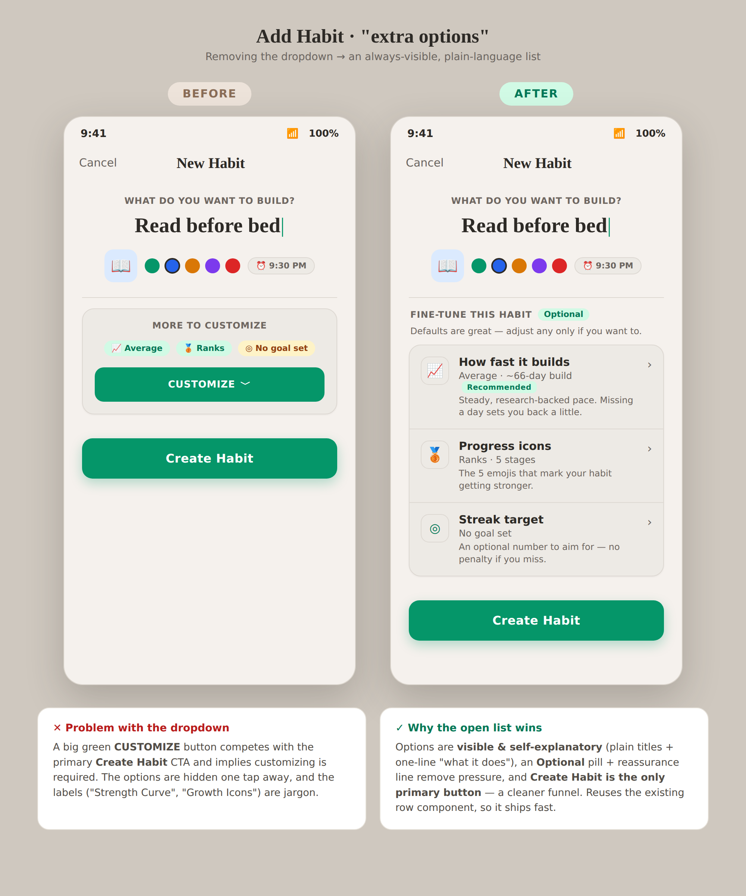
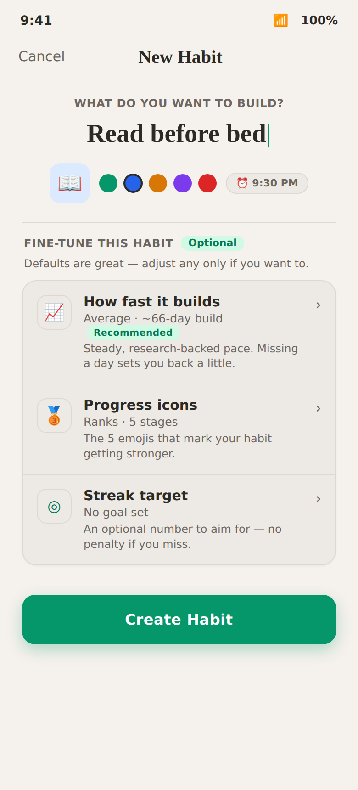

# Feature Specification: Add Habit — "Extra Options" Open List

**Feature Branch**: `claude/habit-add-page-variants-u1b6oy`
**Created**: 2026-07-08
**Status**: Implemented
**Input**: Make the per-habit advanced settings on the Add Habit page easier to understand. Weigh keeping vs. removing the dropdown; explore several variants; choose the one that maximizes ease-of-understanding, user experience, retention, and conversion.
**Design Reference**:

- Chosen design (single screen): `.superdesign/design_iterations/extra_options_final.html`
- Before / after with rationale: `.superdesign/design_iterations/before_after.html`
- Variants explored: `.superdesign/design_iterations/extra_options_{1..6}.html`

---

## Visual Reference

### Before → After

**Before** — a "More to customize" accordion: three preview chips and a large green **CUSTOMIZE** button that expanded three jargon-labeled rows.
**After** — an always-visible, plain-language list; **Create Habit** is the only primary button.

### Chosen design (detail)

---

## Problem

The per-habit advanced settings lived behind a dropdown in `AdvancedOptionsSection`:

1. **Competing call-to-action.** A full-width green **CUSTOMIZE** button sat directly above the
   primary **Create Habit** button. Two green buttons competed for attention and implied that
   customizing was a required step in the flow.
2. **Hidden, jargon-labeled options.** The three options were one tap away and named
   "Strength Curve", "Growth Icons", and "Streak Goal" — labels that don't tell a new user what
   they do or that they are safe to skip.

Both issues work against ease-of-understanding and conversion on the most important screen in the
creation flow.

## Goal

Present the three per-habit options so they are immediately understandable and clearly optional,
without letting them distract from completing habit creation.

---

## User Scenarios & Testing _(mandatory)_

### User Story 1 - Understand the options at a glance (Priority: P1)

A first-time user reaches the bottom of the Add Habit screen. Instead of a "Customize" button, they
see a short list titled **"Fine-tune this habit · Optional"**. Each row states, in plain language,
what it controls, its current value, and a one-line description. They understand what each option
does without opening anything.

**Why this priority**: Ease-of-understanding is the primary objective. If users can't tell what the
options do or whether they matter, the section is noise that slows down creation.

**Independent Test**: Open Add Habit; confirm the three rows are visible with plain titles, current
values, and descriptions, and that an "Optional" pill is present.

**Acceptance Scenarios**:

1. **Given** the Add Habit screen is open, **When** the user scrolls to the extra-options section,
   **Then** they see a header "Fine-tune this habit" with an "Optional" pill and the line
   "Defaults are great — adjust any only if you want to."
2. **Given** the section is visible, **Then** three rows are shown **without any expand/collapse
   control**: **How fast it builds** (`Average · ~66-day build`), **Progress icons**
   (`Ranks · 5 stages`), and **Streak target** (`No goal set`).
3. **Given** the strength-curve row uses the default (balanced) algorithm, **Then** a
   **"Recommended"** badge appears next to its title.
4. **Given** each row, **Then** it shows a one-line description of what the option does.

---

### User Story 2 - Create a habit without touching the options (Priority: P1)

A user just wants to create a habit quickly. They type a name and tap **Create Habit** without
interacting with the extra options. The habit is created with sensible defaults.

**Why this priority**: The extra options must never feel required. A single, unambiguous primary
action protects conversion.

**Independent Test**: Enter a name and tap Create Habit without opening any option; the habit is
created with default strength curve (Average), default progress icons (Ranks), and no streak goal.

**Acceptance Scenarios**:

1. **Given** the Add Habit screen, **When** the user views the bottom of the form, **Then**
   **Create Habit** is the only full-width primary (green) button on screen.
2. **Given** the user has not opened any option, **When** they tap Create Habit, **Then** the habit
   is created with defaults: strength = Average/`balanced`, icons = Ranks, streak goal = none.

---

### User Story 3 - Adjust an option and have it persist (Priority: P2)

A user taps a row to change how the habit grows. The relevant editor opens, they make a change, and
the row reflects the new value; the created/edited habit stores it.

**Independent Test**: Tap each row, change its value, confirm the row updates and the value is saved.

**Acceptance Scenarios**:

1. **Given** the list, **When** the user taps a row, **Then** the matching editor opens — **How
   fast it builds** → Strength Curve sheet, **Progress icons** → Growth Icons sheet, **Streak
   target** → Streak Goal sheet.
2. **Given** a Streak target has been set to N days, **Then** the row subtitle reads "N-day goal"
   and the row icon takes the amber (streak) treatment; with no goal it stays neutral and reads
   "No goal set".
3. **Given** a changed value, **When** the user saves the habit, **Then** the value persists on the
   created/edited habit.

---

### User Story 4 - Consistent across all entry points (Priority: P2)

The same open-list pattern appears wherever the section is used, so users learn it once.

**Independent Test**: Confirm the identical list renders in Add Habit, Edit Habit, and the Template
Preview customization flow.

**Acceptance Scenarios**:

1. **Given** `AdvancedOptionsSection` is rendered on **Add Habit**, **Edit Habit**, or **Template
   Preview**, **Then** all three show the same open list (no dropdown).
2. **Given** the Template Preview flow, **When** a template defines a growth type, **Then** the
   growth-type pill still renders above the rows.

---

## Requirements _(functional)_

- **FR-1** The section MUST render the three options as an always-visible list with no
  expand/collapse control and no secondary "Customize" call-to-action button.
- **FR-2** Titles MUST be plain language; the technical value MUST remain visible as the subtitle.
- **FR-3** The section MUST be labeled **Optional** and include reassurance copy.
- **FR-4** The default strength algorithm (`balanced`) MUST show a **Recommended** badge.
- **FR-5** The Streak target row MUST render neutrally when no goal is set and adopt the streak
  (amber) treatment once a goal is set.
- **FR-6** Tapping a row MUST open the existing editor for that option; editors and their behavior
  are unchanged.
- **FR-7** The pattern MUST apply to every consumer of `AdvancedOptionsSection` (Add, Edit,
  Template Preview).
- **FR-8** No functional regression to how strength curve, progress icons, or streak goal values are
  chosen, defaulted, or persisted.

### Copy (source of truth)

| Row      | Title              | Subtitle                          | Description                                                         |
| -------- | ------------------ | --------------------------------- | ------------------------------------------------------------------- |
| Strength | How fast it builds | `{Algorithm} · ~{days}-day build` | Steady, research-backed pace. Missing a day sets you back a little. |
| Icons    | Progress icons     | `{Preset} · 5 stages`             | The 5 emojis that mark your habit getting stronger.                 |
| Streak   | Streak target      | `No goal set` / `{n}-day goal`    | An optional number to aim for — no penalty if you miss.             |

Header: **Fine-tune this habit** · pill **Optional** · line "Defaults are great — adjust any only if you want to."

---

## Alternatives Considered

Six variants were mocked and reviewed; V5 was dropped at the user's request. The chosen design is
**V2 (open list)** combined with **V6's plain-language labels**.

| #   | Variant                     | Dropdown? | Notes                                     | Screenshot               |
| --- | --------------------------- | --------- | ----------------------------------------- | ------------------------ |
| 1   | Accordion (original)        | Yes       | Baseline; dual green CTAs, jargon         | `./assets/variant-1.png` |
| 2   | **Open list (chosen base)** | No        | Clearest; reuses existing row component   | `./assets/variant-2.png` |
| 3   | Smart-defaults banner       | Yes       | Reassurance-first, but still hides values | `./assets/variant-3.png` |
| 4   | Card grid                   | No        | Visual, compact; terse labels             | `./assets/variant-4.png` |
| 5   | Tappable chips (dropped)    | No        | Most compact; least descriptive           | `./assets/variant-5.png` |
| 6   | Guided rows (label source)  | No        | Most educational; tallest                 | `./assets/variant-6.png` |

---

## Implementation Notes

- `src/components/AdvancedOptions/AdvancedOptionsSection.tsx` — orchestrator; renders header + rows
  - sheets (decomposed into `AdvancedOptionsHeader`, `AdvancedOptionsRows`, `AdvancedOptionsSheets`,
    and the `useAdvancedRowSummary` hook to satisfy the 100-line file rule).
- `src/components/AdvancedOptions/AdvancedOptionRow.tsx` — added an optional `titleBadge` (rendered
  via the extracted `AdvancedOptionRowTitle`).
- Removed the accordion animation hook (`useAdvancedOptionsAccordion.ts`) and the
  `onExpand` / `onAdvancedExpand` / `scrollToEnd` plumbing across `HabitFormBody`,
  `CreateHabitScrollContent`, `HabitEditScreen`, and the Template Preview components.
- Reused unchanged: `AdvancedSheet`, `GrowthIconsSheetBody`, `StreakGoalSheetBody`,
  `StrengthCurveSheetBody`, `StrengthCurvePickerModal`, `ALGORITHM_COPY`, `resolveProgressEmojis`,
  `getGrowthTypeMeta`.

## Verification

- Unit: `src/components/AdvancedOptions/__tests__/AdvancedOptionsRows.test.tsx` — asserts the three
  rows render with correct values, the Recommended badge logic, the streak value, and that each row
  opens its matching sheet.
- `tsc -p tsconfig.app.json --noEmit` — 0 errors.
- ESLint — no `max-lines` violations in changed files.
- Manual (Add / Edit / Template Preview, light + dark): three rows visible with plain labels and
  Optional pill, no Customize button, Create Habit the only primary CTA, each row opens its editor,
  changed values persist.
